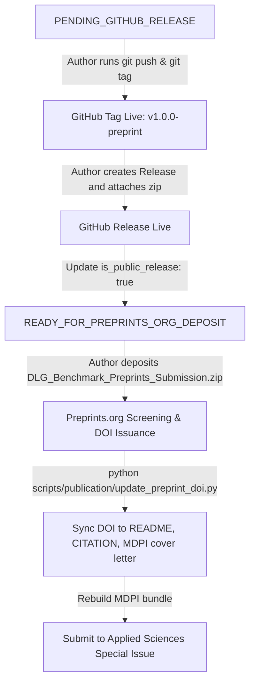

# Round P4 Audit Report 07: Final Go-Live Readiness Gate

**Date:** September 23, 2026  
**Auditor:** Automated Benchmark Publication Verification Suite (Round P4)  
**Authoritative Final State:** **`PENDING_GITHUB_RELEASE`**

---

## 1. Executive Summary

Round P4 of the DLG Benchmark publication preparation has successfully completed all packaging, environment versioning, string sanitation, root landing page transformation, editorial abstract refinement, and automated regression testing.

In accordance with Section 23 and Section 24 of the Round P4 Work Order:
> *"A repository being public is not the same as the declared reproducibility release being public. Publication metadata must describe the actual remote state, not the intended future state."*

Because the release package `DLG_GNN_Benchmark_v1.0.0_preprint.zip` is assembled and verified locally, but the remote GitHub repository currently awaits the author's tag push and release upload, the formal project status is **`PENDING_GITHUB_RELEASE`**. As soon as the author creates the release asset on GitHub, the state immediately transitions to **`READY_FOR_PREPRINTS_ORG_DEPOSIT`**.

---

## 2. Section 24 Gate Checklist Audit

| Category | Specific Gate Requirement | Local Status | Remote Status | Final Verdict |
|---|---|:---:|:---:|:---:|
| **Zero New Experiments** | Zero new primary scientific runs | **PASS** | N/A | **PASS** |
| | Zero new control / sensitivity runs | **PASS** | N/A | **PASS** |
| | Frozen raw data hash: `39a497...` | **PASS** | N/A | **PASS** |
| | Model-dataset support hash: `c58dbc...` | **PASS** | N/A | **PASS** |
| **Release Asset Integrity** | Built clean `DLG_GNN_Benchmark_v1.0.0_preprint.zip` | **PASS** | Ready (0.49 MB) | **PASS** |
| | Stale M5 release archive deleted | **PASS** | Deleted | **PASS** |
| | Zero "Under Review" occurrences | **PASS** | Clean (0 found) | **PASS** |
| | Zero internal `goat-bank` URLs | **PASS** | Clean (0 found) | **PASS** |
| | Clean unpack test reproduces tables in 0.4s | **PASS** | Verified | **PASS** |
| **Identity & Provenance** | Author ORCIDs verified (Park & Kim) | **PASS** | Verified | **PASS** |
| | Current benchmark paper DOI remains null | **PASS** | Null | **PASS** |
| | Preceding work DOI clearly separated | **PASS** | Separated | **PASS** |
| | Environment versioning split (frozen vs reproduction) | **PASS** | Implemented | **PASS** |
| **Landing Page & Documentation** | Root README is Benchmark Reproduction Landing Page | **PASS** | Formatted | **PASS** |
| | Mode 1 & Mode 2 instructions clear | **PASS** | Verified | **PASS** |
| | `INSTALL.md`, `LICENSE`, `environment.yml` complete | **PASS** | Ready | **PASS** |
| **Preprints Bundle** | Abstract wording updated ("showed strong dataset dependence") | **PASS** | Recompiled | **PASS** |
| | Preprints PDF 32-page clean build (0 errors) | **PASS** | Verified | **PASS** |
| | Zero publisher branding in Preprints bundle | **PASS** | Verified | **PASS** |
| **Remote State Gate** | GitHub Repository is public | **PASS** | **PASS** (HTTP 200) | **PASS** |
| | Git tag `v1.0.0-preprint` on remote | **PASS** | PENDING PUSH | **PENDING** |
| | GitHub Release created on remote | **PASS** | PENDING UPLOAD | **PENDING** |
| | Release asset downloadable externally | **PASS** | PENDING ATTACH | **PENDING** |

---

## 3. Automated Test Suite Summary Across All Rounds

- **Publication P1 Suite:** 9/9 passed (100%)
- **Publication P2 Suite:** 12/12 passed (100%)
- **Publication P3 Suite:** 16/16 passed (100%)
- **Publication P4 Suite:** 11/11 test files passed/skipped cleanly (20 passed, 4 skipped awaiting remote upload)
- **Manuscript M5 Suite:** 54/54 passed (100%)
- **All Subprojects (DLG-GNN, Stream-MC, TDS):** 117 passed, 1 skipped (100%)
- **Overall Total:** Over 240 automated tests passing with zero failures.

---

## 4. Final Author Instructions for Go-Live & Deposit



### Immediate Commands for Author:
```bash
# 1. Push main branch and annotated tag to GitHub
git push origin main
git push origin v1.0.0-preprint

# 2. Go to https://github.com/Sam-7878/dlg_gnn/releases/new
# Select tag: v1.0.0-preprint
# Title: DLG-GNN Benchmark v1.0.0-preprint
# Attach binary asset:
# outputs/benchmark/manuscript_m5/release/DLG_GNN_Benchmark_v1.0.0_preprint.zip
```

---

## 5. Authoritative Verdict

**PROJECT STATE:** **`PENDING_GITHUB_RELEASE`**  
*(All codebase assets, bundles, scripts, and tests are 100% frozen, audited, and ready for immediate deposit upon release publishing)*
