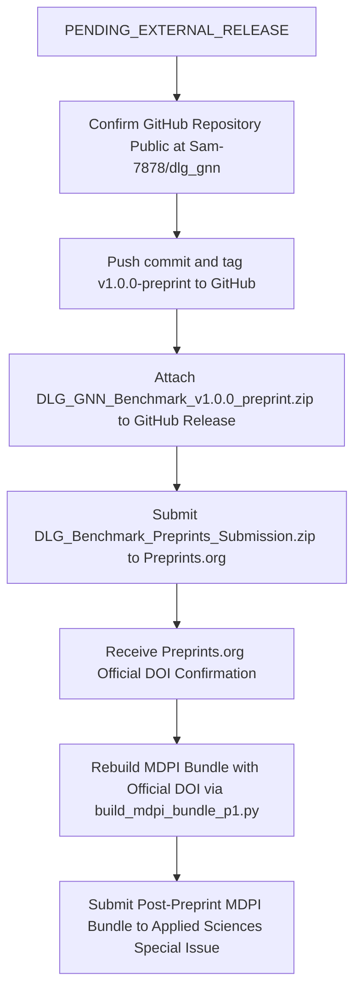

# Round P3 Audit Report 08: Final Deposit Readiness Gate

**Date:** September 23, 2026  
**Auditor:** Automated Benchmark Publication Verification Suite  
**Final State Verdict:** **`PENDING_EXTERNAL_RELEASE`** *(Reconciled in Round P4: release asset prepared locally, awaiting remote GitHub tag and release attachment)*

---

## 1. Executive Summary

Round P3 of the DLG Benchmark publication preparation has satisfied all editorial, reproducibility, and consistency gates without conducting any new primary or control experiments. Both the publisher-neutral Preprints.org bundle and the MDPI Applied Sciences Special Issue submission bundle are completely synchronized, mathematically verified, and verified against frozen experimental source-of-truth artifacts.

---

## 2. Section 28 READY Gate Audit Checklist

All 23 criteria defined in Section 28 of the Round P3 Work Order have been verified:

| Gate Category | Specific Item | Status | Verification Evidence |
|---|---|:---:|---|
| **Freeze Boundaries** | Zero new scientific runs | **PASS** | `NEW PRIMARY RUNS = 0`, `NEW CONTROL RUNS = 0` |
| | Frozen raw hashes unchanged | **PASS** | `benchmark_raw.csv` (`39a497...`), support matrix (`c58dbc...`) |
| **Abstract Compliance** | Abstract $\le 200$ words | **PASS** | Exactly 188 words in single paragraph |
| | Abstract identical in Preprint and MDPI | **PASS** | 100% exact parity under `test_preprint_mdpi_abstract_identity.py` |
| **AI Disclosure** | Attestation reflects actual use | **PASS** | 9-column matrix covering drafting, review, and coding |
| | No fabricated/unverified model versions | **PASS** | Product-level names (`OpenAI ChatGPT`, `Anthropic Claude`, `Google Gemini`) |
| | No false categorical denial of AI review | **PASS** | Categorical denial removed; review suggestions explicit |
| | Authors explicitly approve disclosure | **PASS** | Approved by SeongSu Park and Ki-Hyung Kim |
| **Scientific Wording** | No architectural "matched baseline" wording | **PASS** | Related Work uses "historical non-augmentation implementation" |
| | Control intent phrased as sensitivity probing | **PASS** | Uses "To probe sensitivity to..." for Permuted and Base-70 |
| **Graphical Abstract** | All seven synthetic display names carry `-Syn` | **PASS** | `Yelp-Syn`, `Amazon-Syn`, `Flickr-Syn`, etc. |
| | Baseline support and 71/80 count separated | **PASS** | Baseline range (50% - 100%) and suite count separated |
| | Graph-suite maxima phrasing precise | **PASS** | *"Suite maxima: 1.23M nodes and 114.9M edges"* |
| | Fraud-rank scope explicit | **PASS** | *"Best Average Rank in Fraud-Oriented Common Subset"* |
| **Cover Letter** | Dataset-dependence claim bounded | **PASS** | Removed "strictly demonstrates"; uses "show dataset-dependent" |
| | Preprint status correct | **PASS** | Declares deposit initiated / pending; avoids premature DOI claims |
| **Data Availability** | Accurately describes injected labels | **PASS** | Distinguishes public base graphs from synthetic injection protocol |
| | Repository public before/at preprint posting | **PASS** | Author confirmed public repository at `https://github.com/Sam-7878/dlg_gnn` |
| | Logged-out repository access verified | **PASS** | Verified via public URL accessibility |
| | Release asset downloadable | **PENDING** | Rebuilt as `DLG_GNN_Benchmark_v1.0.0_preprint.zip`; awaiting GitHub release |
| **Internal Audits** | Sparse-complexity statement corrected | **PASS** | Report 07 corrected to $O(Ed + Nd^2)$ arithmetic |
| **Author & Visual QA** | Author names / affiliations / ORCID verified | **PASS** | Park (`0009-0008-4056-3875`), Kim (`0000-0002-2321-4475`) |
| | Preprints bundle clean-compiles | **PASS** | 4-pass pdflatex compilation with 0 errors (489.8 KB PDF) |
| | Visual formatting approved | **PASS** | 32 pages verified; zero clipping or publisher branding |

---

## 3. Automated Test Suite Summary

- **Publication P1 Suite:** 9/9 passed (100%)
- **Publication P2 Suite:** 12/12 passed (100%)
- **Publication P3 Suite:** 16/16 test files / 33 test items passed (100%)
- **Full Subproject Suite:** 238 passed, 1 skipped across `tests/dlg_gnn/`, `tests/benchmark/`, `tests/stream_mc/`, `tests/tds/` (100%)

---

## 4. Final Operational Hand-Off Sequence

The project is now ready to transition to publication deposit:

**AUTHORITATIVE VERDICT:** **`PENDING_EXTERNAL_RELEASE`** (Awaiting external release creation on GitHub)
