# 01. System Architecture Overview

This document provides a high-level architectural overview of the **DLG-GNN** repository, its guiding design principles, and the functional division between its four core subprojects.

---

## 1. Executive Vision & Motivation

Graph Neural Networks (GNNs) for anomaly and fraud detection face two critical bottlenecks in real-world production and scientific evaluation:
1. **The Scalability & Dense Matrix Bottleneck:** Many state-of-the-art anomaly detectors (such as DOMINANT or GAD-NR) rely on reconstructing the dense adjacency matrix $\mathbf{A} \in \mathbb{R}^{N \times N}$. This imposes an $O(N^2)$ memory requirement, causing out-of-memory (OOM) failures on graphs beyond $\sim 50{,}000$ nodes.
2. **Coupled Multi-Hop Distortion:** Standard GNN message passing simultaneously smooths local neighborhood features and distant structural signals, suffering from over-smoothing or dilution of subtle localized fraud motifs.
3. **Reproducibility Deficits:** Many published GNN benchmarks conflate synthetic anomaly generation with base graph definitions, evaluate on limited datasets, or report empirical gains without non-parametric statistical significance testing.

**DLG-GNN solves these challenges through:**
- A **Decoupled Local-to-Global (DLG)** architecture that separates fine-grained ego-net neighborhood aggregation (Level 1) from macro-level relational propagation (Level 2).
- An **Exact Sparse Message Reconstruction** engine that mathematically computes the exact Frobenius adjacency reconstruction error in $O(|E|d + Nd^2)$ arithmetic without ever materializing an $N \times N$ dense matrix.
- A **Unified Multi-Domain Platform** spanning static graph anomaly detection (`dlg_gnn`), empirical benchmarking (`benchmark`), real-time streaming AML (`stream_mc`), and multi-hop transaction decomposition (`tds`).

---

## 2. System Architecture Diagram

```mermaid
flowchart TB
    subgraph DataLayer["1. Data Ingestion & Transformation Layer"]
        D1["Static Graph Benchmarks<br>(PyGOD, SNAP, Kaggle, FinVolution)"]
        D2["LANL Cyber Event Logs<br>(Authentication / Process Streams)"]
        D3["Streaming Transaction Feeds<br>(Kafka / Financial Events)"]
        D4["Multi-hop Transaction Logs<br>(Bipartite & Directed Accounts)"]
    end

    subgraph ProcessingEngines["2. Core Subproject Processing Engines"]
        direction TB

        subgraph DLG_GNN_Subproject["Subproject 1: dlg_gnn (Core Model Stack)"]
            M1["Level 1: Local Ego-Net Encoder<br>(Direction-aware, k-hop motif preservation)"]
            M2["Level 2: Global Relational Encoder<br>(Graph-wide structural propagation)"]
            M3["Learnable Fusion Gate (α)<br>Z = α Z_local + (1-α) Z_global"]
            M4["Exact Sparse Reconstruction Engine<br>(Frobenius loss via closed-form Gram computation)"]
            M1 --> M3
            M2 --> M3
            M3 --> M4
        end

        subgraph Benchmark_Subproject["Subproject 2: benchmark (Scientific Evaluation)"]
            B1["10 Primary Datasets + LANL External Protocol"]
            B2["8 Detector Configurations (71/80 Supported Pairs)"]
            B3["Mode 1 (Instant Frozen Table Extraction < 1s)"]
            B4["Mode 2 (Full Pipeline Re-execution)"]
            B5["Non-Parametric Statistical Engine<br>(Friedman Rank Test & Holm-adjusted Wilcoxon)"]
            B1 --> B2 --> B5
            B3 -.-> B5
            B4 -.-> B5
        end

        subgraph StreamMC_Subproject["Subproject 3: stream_mc (Dynamic AML Engine)"]
            S1["Bounded-State Sliding Window"]
            S2["Relation State Tracking & Dynamic Subgraph Store"]
            S3["Real-time Risk Propagation & Priority Triage Router"]
            S1 --> S2 --> S3
        end

        subgraph TDS_Subproject["Subproject 4: tds (Transaction Decomposition)"]
            T1["Bipartite / Directed Transaction Decomposition"]
            T2["LLM Entity & Context Extraction"]
            T3["Micro-RAG Uncertainty-Aware Scoring"]
            T1 --> T2 --> T3
        end
    end

    subgraph OutputsLayer["3. Output & Consumption Layer"]
        O1["PyGOD / PyG Deployments<br>(Standalone Anomaly Detection)"]
        O2["Empirical Evidence & Tables<br>(Preprint / Journal Packages)"]
        O3["Real-Time Fraud Alerts<br>(Low-latency Transaction Triage)"]
        O4["Investigative Subgraphs<br>(Forensic AML Case Files)"]
    end

    D1 --> DLG_GNN_Subproject
    D1 --> Benchmark_Subproject
    D2 --> Benchmark_Subproject
    D3 --> StreamMC_Subproject
    D4 --> TDS_Subproject

    DLG_GNN_Subproject --> O1
    Benchmark_Subproject --> O2
    StreamMC_Subproject --> O3
    TDS_Subproject --> O4
```

---

## 3. Four Core Subprojects Overview

The repository is organized into four complementary domains:

### 3.1 `dlg_gnn` (Core Model Architecture)
- **Mission:** High-performance, scalable graph anomaly detection compatible with PyTorch Geometric and PyGOD.
- **Key Modules:**
  - `src/gog_fraud/models/pygod/dlg.py`: The primary `DLG` detector inheriting from PyGOD's `DeepDetector`.
  - `src/gog_fraud/models/pygod/exact_reconstruction.py`: Closed-form Gram and chunked exact reconstruction backends.
  - `src/gog_fraud/models/pygod/shared_reconstruction.py`: Shared latent decoders for joint attribute and structure reconstruction.
  - `src/gog_fraud/models/level1/` and `level2/`: Hierarchical local and global model components.

### 3.2 `benchmark` (Scientific Reproducibility & Evaluation)
- **Mission:** Rigorous, publication-grade empirical benchmarking across diverse graph topologies, scale regimes, and anomaly injection scenarios.
- **Key Characteristics:**
  - 10 primary benchmark graphs (Yelp-Syn, Amazon-Syn, Flickr-Syn, Reddit-Syn, Cora-Syn, CiteSeer-Syn, PubMed-Syn, BitcoinOTC, Elliptic, DGraphFin) plus LANL-RedTeam external validation.
  - 8 detector configurations covering DLG variants (`DLG-Aug`, `DLG-Base`, `DLG-Aug-Permuted`, `DLG-Base-70`), baselines (DOMINANT, GAD-NR, GAAN, OCGN).
  - Dual-mode reproduction: Mode 1 instant artifact reproduction (`scripts/reproduce_frozen_artifacts.py`) and Mode 2 full training pipeline (`experiments/benchmark/run_sci_round5_final.py`).
  - Automated statistical testing (Friedman test, Holm-adjusted Wilcoxon signed-rank tests).

### 3.3 `stream_mc` (Streaming Monte Carlo Engine)
- **Mission:** Low-latency online anomaly detection and AML risk scoring on evolving temporal transaction streams.
- **Key Modules:**
  - `src/gog_fraud/streaming/engine.py`: Dynamic streaming processing loop.
  - `src/gog_fraud/streaming/subgraph_store.py`: Bounded-state memory manager storing active $k$-hop neighborhoods.
  - `src/gog_fraud/streaming/relation_state.py`: Temporal state tracker for evolving account relationships.
  - `src/gog_fraud/selection/`: Priority-based transaction routing for AML triage.

### 3.4 `tds` (Transaction Decomposition System)
- **Mission:** Granular decomposition of complex multi-entity transactions into structured subgraphs, integrated with LLM reasoning and micro-RAG.
- **Key Modules:**
  - `tests/tds/micro_rag/graph_builder.py`: Converts complex transaction logs into bipartite and directed graphs.
  - `tests/tds/micro_rag/uncertainty_aware_dlg.py`: Couples DLG structural embeddings with uncertainty quantification.
  - `tests/tds/micro_rag/llm_extractor.py`: Extracts semantic entity relationships from unstructured AML notes.

---

## 4. Key Design Principles

1. **Decoupled Representation:** Never force a single GNN layer to simultaneously optimize for local anomaly isolation and global connectivity. Decouple local aggregation from global propagation and learn the fusion balance.
2. **Exact Scalability Without Approximations:** Avoid mini-batch sampling heuristics that drop negative edges or compromise exact Frobenius reconstruction error. Use closed-form sparse algebra ($O(|E|d + Nd^2)$) instead.
3. **Strict Symmetry Across Workflows:** Tests, reports, and results mirror the four subproject domains (`dlg_gnn`, `benchmark`, `stream_mc`, `tds`), preventing monolithic entanglements.
4. **Zero-Drift Scientific Provenance:** All empirical benchmark results are cryptographically hashed and tied to dual environment specifications (`frozen_execution_environment.json` and `current_reproduction_environment.json`).
