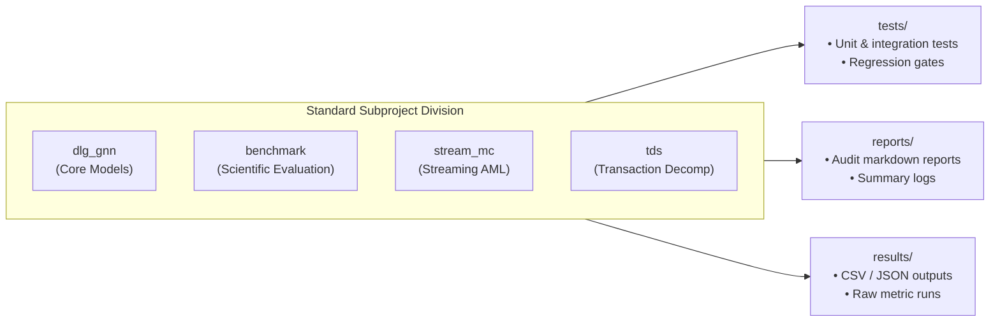

# 02. Directory & Source Structure Guide

This document maps the complete file layout of the `dlg_gnn` repository, explains the responsibilities of each directory, and outlines the architectural conventions that keep the codebase modular, maintainable, and easily reusable.

---

## 1. Top-Level Repository Map

```text
dlg_gnn/
├── src/                         # Core Python package implementations
│   ├── gog_fraud/               # Main DLG, GNN, and streaming AML engine
│   └── analysis/                # Statistical ranking and homophily analysis
├── configs/                     # Declarative YAML configurations for models and experiments
├── experiments/                 # Benchmark experiment entrypoints and control runners
├── scripts/                     # Operational utilities (reproduction, env verification, packaging)
├── tests/                       # Automated test suite (symmetrically organized)
│   ├── dlg_gnn/                 # Unit & integration tests for core DLG-GNN models
│   ├── benchmark/               # Tests for benchmark runners, artifacts, and publication gates
│   ├── stream_mc/               # Tests for streaming engine and router
│   └── tds/                     # Tests for transaction decomposition & micro-RAG
├── reports/                     # Human-readable execution and audit reports (symmetrically organized)
│   ├── dlg_gnn/
│   ├── benchmark/
│   ├── stream_mc/
│   └── tds/
├── results/                     # Empirical result outputs and metric logs (symmetrically organized)
│   ├── dlg_gnn/
│   ├── benchmark/
│   ├── stream_mc/
│   └── tds/
├── outputs/                     # Frozen publication artifacts, releases, and provenance manifests
│   └── benchmark/manuscript_m5/ # Release archives, manifests, and canonical CSV tables
├── publication/                 # Publication drafts, TeX sources, and camera-ready packages
│   └── benchmark/               # Preprints.org and MDPI Applied Sciences bundles
├── docs/                        # Technical documentation
│   ├── architecture/            # This architectural documentation suite
│   └── math/                    # Formal mathematical proofs (e.g., exact sparse reconstruction)
├── pyproject.toml               # PEP 518/621 build and tool configuration
├── environment.yml              # Conda environment specification
├── INSTALL.md                   # Installation and environment setup instructions
├── LICENSE                      # Permissive MIT License
├── CITATION.cff                 # Citation metadata for academic reuse
└── README.md                    # Root Benchmark Reproduction Landing Page
```

---

## 2. Deep Dive: `src/` Package Architecture

The core logic resides in `src/gog_fraud/` and `src/analysis/`.

### 2.1 `src/gog_fraud/models/` (Model Layer)
Defines the neural network modules, encoders, decoders, and PyGOD detector wrappers:

```text
src/gog_fraud/models/
├── pygod/                       # PyGOD-compatible detector implementations
│   ├── dlg.py                   # Decoupled Local-to-Global (DLG) detector class
│   ├── dlg_base.py              # DLG-Base (historical non-augmented baseline)
│   ├── dlg_full.py              # DLG-Full (comprehensive multi-layer configuration)
│   ├── exact_reconstruction.py  # Closed-form Gram & chunked exact Frobenius loss backend
│   ├── shared_reconstruction.py # Shared latent decoders for attributes & structure
│   ├── sparse_message.py        # Sparse message passing & motif aggregation
│   └── gadnr.py                 # GAD-NR baseline implementation
├── level1/                      # Level 1 (Local Ego-Net) encoders
│   ├── level1_gnn.py            # Local neighborhood feature & topology encoder
│   └── model.py                 # High-level Level 1 model wrapper
├── level2/                      # Level 2 (Global Relational) encoders
│   └── model.py                 # Global relational interaction network
├── fusion/                      # Fusion gating mechanisms
│   └── model.py                 # Learnable alpha gating combining local & global embeddings
└── baselines/                   # Reference baselines (DOMINANT, GAAN, OCGN)
```

### 2.2 `src/gog_fraud/streaming/` & `selection/` (Streaming AML Layer)
Provides dynamic sliding windows and stateful graph engines:

```text
src/gog_fraud/streaming/
├── engine.py                    # Real-time event consumption & scoring loop
├── subgraph_store.py            # Bounded-state memory manager storing k-hop subgraphs
├── relation_state.py            # Temporal state tracker for evolving account edges
├── embedding_cache.py           # In-memory LRU cache for node representations
├── queue_manager.py             # Event queue & priority buffering
└── checkpoint.py                # State checkpointing & recovery

src/gog_fraud/selection/
└── router.py                    # Priority-based AML triage router
```

### 2.3 `src/gog_fraud/pipelines/` & `src/gog_fraud/data/` (Pipeline & Data Layer)
Connects datasets, training loops, evaluation, and tuning:

```text
src/gog_fraud/pipelines/
├── run_sci_round5.py            # Primary benchmark pipeline orchestrator
├── run_sci_round4a.py           # Exact sparse reconstruction pipeline
├── run_sci_round4b.py           # Sparse message passing pipeline
├── run_streaming_replay.py      # Replay historical transaction logs through stream engine
├── run_fraud_benchmark.py       # End-to-end multi-dataset benchmark execution
└── run_tuning_workflow.py       # Hyperparameter optimization workflow

src/gog_fraud/data/
├── dgraphfin_aligned.py         # DGraphFin dataset loader & aligner
├── preprocessing/               # Feature normalization & missing value imputation
├── splits/                      # Fixed seed train/val/test split generators
└── transforms/                  # Anomaly injection transforms (-Syn protocol)
```

### 2.4 `src/analysis/` (Statistical & Empirical Analysis)
Contains statistical testing routines for publication and evaluation:

```text
src/analysis/
├── compute_homophily.py         # Node, edge, and label homophily calculators
├── add_benchmark_analysis.py    # Non-parametric Friedman & Wilcoxon-Holm testing
├── plot_benchmark_analysis.py   # Publication-quality plotting routines
└── utils.py                     # Metric conversion & aggregation helpers
```

---

## 3. Configuration Management: `configs/`

The repository relies on declarative YAML configurations to decouple experiment parameters from code:

```text
configs/
├── benchmark/
│   ├── sci_round5_final.yaml          # Canonical configuration for primary 10-dataset benchmark
│   ├── sci_round4a_exact_sparse.yaml  # Config for exact sparse reconstruction validation
│   ├── sci_round4b_sparse_message.yaml# Config for sparse message passing experiments
│   ├── sci_round4c_production.yaml    # Production-tuned hyperparameters
│   └── sci_defense_extension.yaml     # Sensitivity and capacity control settings
```

---

## 4. Tests, Reports, and Results Symmetry

To prevent code drift and preserve clean domain separation, `tests/`, `reports/`, and `results/` are structured identically:



---

## 5. Architectural Layering Rules

When modifying or extending the codebase, adhere to the following dependency hierarchy:

1. **Common & Types (`src/gog_fraud/common/`)**: Zero dependencies on models or pipelines.
2. **Data & Transforms (`src/gog_fraud/data/`)**: Depends only on PyTorch Geometric, PyTorch, and common types.
3. **Model Layer (`src/gog_fraud/models/`)**: Depends on PyTorch, PyG, PyGOD, and data definitions. Must not import from `pipelines/` or `experiments/`.
4. **Streaming Layer (`src/gog_fraud/streaming/`)**: Depends on models and common data structures. Can be used as an independent library.
5. **Pipelines & Experiments (`src/gog_fraud/pipelines/`, `experiments/`)**: Top-level orchestration. Imports models, data, configs, and evaluation routines.
