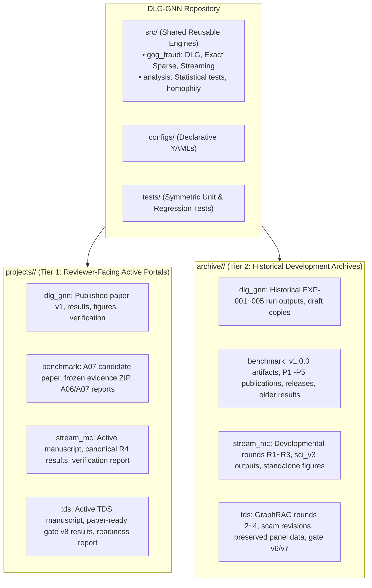

# 02. Directory & Source Structure Guide

This document maps the complete file layout of the `dlg_gnn` repository, explains the responsibilities of each directory, and outlines the architectural conventions that keep the codebase modular, maintainable, and easily reusable.

---

## 1. Top-Level Repository Map

```text
dlg_gnn/
├── src/                         # Reusable core Python packages
│   ├── gog_fraud/               # Main DLG, GNN, and streaming AML engine
│   └── analysis/                # Statistical ranking and homophily analysis
├── configs/                     # Declarative YAML configurations for models and experiments
├── scripts/                     # Shared reproduction driver and operational utilities
│   └── reproduce_project.py     # Unified verification & reproduction facade driver
├── projects/                    # [TIER 1: ACTIVE] Reviewer-facing portal for 4 subprojects
│   ├── dlg_gnn/                 # Published predecessor paper, verification, figures, and results
│   ├── benchmark/               # A07 candidate paper, frozen evidence ZIP, final reports, and manuscript scripts
│   ├── stream_mc/               # Active streaming manuscript, canonical R4 results, and verification reports
│   └── tds/                     # Active TDS manuscript, paper-ready gate v8 results, and readiness reports
├── archive/                     # [TIER 2: HISTORICAL] Archived legacy code, earlier evaluation rounds, drafts
│   ├── dlg_gnn/                 # Historical run outputs (EXP-001~EXP-005) and early paper drafts
│   ├── benchmark/               # Historical v1.0.0 artifacts, P1~P5 publications, releases, and previous results
│   ├── stream_mc/               # Historical developmental rounds (R1~R3, sci_v3) and evaluation outputs
│   └── tds/                     # Historical GraphRAG/scam revision rounds, preserved panel data, and gates
├── tests/                       # Automated test suite (symmetrically organized by subproject)
│   ├── dlg_gnn/                 # Unit & integration tests for core DLG-GNN models
│   ├── benchmark/               # Tests for benchmark runners and publication gates
│   ├── stream_mc/               # Tests for streaming engine and router
│   └── tds/                     # Tests for transaction decomposition & micro-RAG
├── local_storage/               # Git-ignored wheel-independent backups and LaTeX caches
├── docs/                        # Technical documentation & work reports
│   ├── architecture/            # Architectural documentation suite
│   ├── work_reports/            # Chronological task work orders and implementation logs
│   └── papers/                  # Paper index and pointers to active/archived manuscripts
├── pyproject.toml               # PEP 518/621 build and tool configuration
├── environment.yml              # Conda environment specification
├── INSTALL.md                   # Installation and environment setup instructions
├── LICENSE                      # Permissive MIT License
├── CITATION.cff                 # Citation metadata for academic reuse
└── README.md                    # Multi-project research landing page
```


---

## 2. Deep Dive: `src/` Package Architecture

The core logic resides in `src/gog_fraud/` and `src/analysis/`.

### 2.1 `src/gog_fraud/models/` (Model Layer)
Defines the neural network modules, encoders, decoders, and PyGOD detector wrappers:

```text
src/gog_fraud/models/
├── pygod/                       # PyGOD-compatible detector implementations
│   ├── dlg.py                   # Decoupled Local-to-Global (DLG) detector class
│   ├── dlg_base.py              # DLG-Base (historical non-augmented baseline)
│   ├── dlg_full.py              # DLG-Full (comprehensive multi-layer configuration)
│   ├── exact_reconstruction.py  # Closed-form Gram & chunked exact Frobenius loss backend
│   ├── shared_reconstruction.py # Shared latent decoders for attributes & structure
│   ├── sparse_message.py        # Sparse message passing & motif aggregation
│   └── gadnr.py                 # GAD-NR baseline implementation
├── level1/                      # Level 1 (Local Ego-Net) encoders
│   ├── level1_gnn.py            # Local neighborhood feature & topology encoder
│   └── model.py                 # High-level Level 1 model wrapper
├── level2/                      # Level 2 (Global Relational) encoders
│   └── model.py                 # Global relational interaction network
├── fusion/                      # Fusion gating mechanisms
│   └── model.py                 # Learnable alpha gating combining local & global embeddings
└── baselines/                   # Reference baselines (DOMINANT, GAAN, OCGN)
```

### 2.2 `src/gog_fraud/streaming/` & `selection/` (Streaming AML Layer)
Provides dynamic sliding windows and stateful graph engines:

```text
src/gog_fraud/streaming/
├── engine.py                    # Real-time event consumption & scoring loop
├── subgraph_store.py            # Bounded-state memory manager storing k-hop subgraphs
├── relation_state.py            # Temporal state tracker for evolving account edges
├── embedding_cache.py           # In-memory LRU cache for node representations
├── queue_manager.py             # Event queue & priority buffering
└── checkpoint.py                # State checkpointing & recovery

src/gog_fraud/selection/
└── router.py                    # Priority-based AML triage router
```

### 2.3 `src/gog_fraud/pipelines/` & `src/gog_fraud/data/` (Pipeline & Data Layer)
Connects datasets, training loops, evaluation, and tuning:

```text
src/gog_fraud/pipelines/
├── run_sci_round5.py            # Primary benchmark pipeline orchestrator
├── run_sci_round4a.py           # Exact sparse reconstruction pipeline
├── run_sci_round4b.py           # Sparse message passing pipeline
├── run_streaming_replay.py      # Replay historical transaction logs through stream engine
├── run_fraud_benchmark.py       # End-to-end multi-dataset benchmark execution
└── run_tuning_workflow.py       # Hyperparameter optimization workflow

src/gog_fraud/data/
├── level2/                      # Level 2 relational meta-graph construction
│   ├── relation_builder.py      # Unsupervised relation builder (embedding k-NN, temporal, entity)
│   └── dataset.py               # Level 2 graph dataset wrapper and persistence
├── dgraphfin_aligned.py         # DGraphFin dataset loader & aligner
├── preprocessing/               # Feature normalization & missing value imputation
├── splits/                      # Fixed seed train/val/test split generators
└── transforms/                  # Anomaly injection transforms (-Syn protocol)

```

### 2.4 `src/analysis/` (Statistical & Empirical Analysis)
Contains statistical testing routines for publication and evaluation:

```text
src/analysis/
├── compute_homophily.py         # Node, edge, and label homophily calculators
├── add_benchmark_analysis.py    # Non-parametric Friedman & Wilcoxon-Holm testing
├── plot_benchmark_analysis.py   # Publication-quality plotting routines
└── utils.py                     # Metric conversion & aggregation helpers
```

---

## 3. Configuration Management: `configs/`

The repository relies on declarative YAML configurations to decouple experiment parameters from code:

```text
configs/
├── benchmark/
│   ├── sci_round5_final.yaml          # Canonical configuration for primary 10-dataset benchmark
│   ├── sci_round4a_exact_sparse.yaml  # Config for exact sparse reconstruction validation
│   ├── sci_round4b_sparse_message.yaml# Config for sparse message passing experiments
│   ├── sci_round4c_production.yaml    # Production-tuned hyperparameters
│   └── sci_defense_extension.yaml     # Sensitivity and capacity control settings
```

---

## 4. Two-Tier Organization: `projects/` (Active) vs `archive/` (Historical)

To prevent developmental clutter and provide an immediately comprehensible view for reviewers, all project-specific assets are divided into two clear tiers:


```mermaid
graph TD
    subgraph RepoRoot["DLG-GNN Repository"]
        Common["src/ (Shared Reusable Engines)<br>• gog_fraud: DLG, Exact Sparse, Streaming<br>• analysis: Statistical tests, homophily"]
        Configs["configs/ (Declarative YAMLs)"]
        Tests["tests/ (Symmetric Unit & Regression Tests)"]
    end

    subgraph Tier1["projects/<project>/ (Tier 1: Reviewer-Facing Active Portals)"]
        P1["dlg_gnn: Published paper v1, results, figures, verification"]
        P2["benchmark: A07 candidate paper, frozen evidence ZIP, A06/A07 reports"]
        P3["stream_mc: Active manuscript, canonical R4 results, verification report"]
        P4["tds: Active TDS manuscript, paper-ready gate v8 results, readiness report"]
    end

    subgraph Tier2["archive/<project>/ (Tier 2: Historical Development Archives)"]
        A1["dlg_gnn: Historical EXP-001~005 run outputs, draft copies"]
        A2["benchmark: v1.0.0 artifacts, P1~P5 publications, releases, older results"]
        A3["stream_mc: Developmental rounds R1~R3, sci_v3 outputs, standalone figures"]
        A4["tds: GraphRAG rounds 2~4, scam revisions, preserved panel data, gate v6/v7"]
    end

    RepoRoot --> Tier1
    RepoRoot --> Tier2
```

### 4.1 Tier 1: `projects/<project>/` (Active Workspace)
Each subproject folder contains only the latest, paper-ready materials needed for review and verification:
- **`paper/`**: Active manuscript TeX, PDF, figures, and bibliography (`paper/current/` or `paper/published_v1/`).
- **`reports/`**: Final audit, verification, and readiness reports.
- **`results/` / `evidence/`**: Canonical evidence used in the paper (e.g. `frozen_a05_a06_evidence.zip` for benchmark; `canonical_r4` for stream_mc; `main_final_v2` for tds).
- **`reproduction.yaml` & `reproduce.*`**: Deterministic reproduction facades driving `scripts/reproduce_project.py`.

### 4.2 Tier 2: `archive/<project>/` (Historical Workspace)
All intermediate artifacts, legacy experiments, previous evaluation rounds, and historical paper drafts are segregated by subproject under `archive/`:
- **`archive/dlg_gnn/`**: Historical run outputs (`EXP-001` to `EXP-005`) and earlier paper drafts.
- **`archive/benchmark/`**: Historical v1.0.0 preprint artifacts (`artifacts/`), older experimental runners (`experiments/`), publication packages (`publication/`), release workspaces (`release/`), environment provenance manifests (`provenance/`), and execution logs (`logs/`).
- **`archive/stream_mc/`**: Intermediate benchmark rounds (`results_sci`, `results_sci_v2`, `sci_v3`, `sci_v3_submission_r1~r3`) and developmental run outputs.
- **`archive/tds/`**: GraphRAG developmental iterations (`round_2` ~ `round_4`), scam revision stages (`scam_revision` ~ `round5`), GoG-SCIMain-v1 dataset and panel backups, and legacy gate files (`v6`, `v7`).

---

## 5. Architectural Layering & Dependency Rules

When modifying or extending the codebase, adhere to the following dependency hierarchy:

1. **Common & Types (`src/gog_fraud/common/`)**: Zero dependencies on models or pipelines.
2. **Data & Transforms (`src/gog_fraud/data/`)**: Depends only on PyTorch Geometric, PyTorch, and common types.
3. **Model Layer (`src/gog_fraud/models/`)**: Depends on PyTorch, PyG, PyGOD, and data definitions. Must not import from pipelines or project-specific manuscript scripts.
4. **Streaming Layer (`src/gog_fraud/streaming/`)**: Depends on models and common data structures. Can be used as an independent library.
5. **Pipelines & Analysis (`src/gog_fraud/pipelines/`, `src/analysis/`)**: Top-level reusable orchestration and statistical evaluation.
6. **Project Facades (`projects/<project>/`)**: Lightweight entry points calling `scripts/reproduce_project.py`. Must never reverse dependency flow or duplicate core logic.

