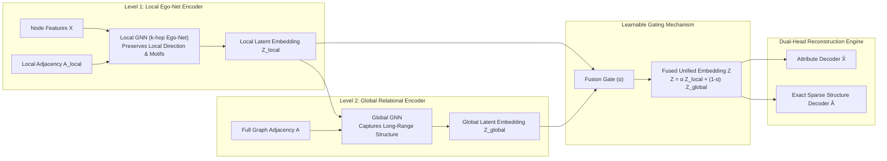

# 03. DLG-GNN Model Architecture & Math Engine

This document details the internal architecture, mathematical formulation, and algorithmic implementation of **DLG-GNN** (*Decoupled Local-to-Global Graph Neural Network*), with particular focus on the **Exact Sparse Reconstruction Engine**.

---

## 1. The Decoupled Local-to-Global Paradigm

Standard graph anomaly detection models (e.g., DOMINANT, GAD-NR) rely on monolithic multi-layer GCNs. In such models, each layer propagates representations across the whole graph, causing two opposing objectives to collide:
1. **Local Anomaly Isolation:** Identifying subtle, isolated attribute discrepancies within a node's immediate 1-hop or 2-hop ego-net.
2. **Global Relational Context:** Aggregating macro-level structural signals across multi-hop graph components.

DLG-GNN decouples these objectives into two dedicated processing tiers:



---

## 2. Mathematical Formulation

Let $G = (V, E, \mathbf{X})$ be an attributed graph where $V$ is the set of $N = |V|$ nodes, $E$ is the set of $|E|$ edges, and $\mathbf{X} \in \mathbb{R}^{N \times d_{\text{in}}}$ is the node feature matrix.

### 2.1 Local Level-1 Representation
For each node $v_i \in V$, Level 1 extracts localized neighborhood representations using directed edge convolutions:
$$\mathbf{h}_i^{(1)} = \sigma \left( \sum_{j \in \mathcal{N}(i) \cup \{i\}} \frac{1}{\sqrt{\tilde{d}_i \tilde{d}_j}} \mathbf{W}_{\text{local}} \mathbf{x}_j \right)$$
where $\mathcal{N}(i)$ denotes the incoming neighborhood and $\mathbf{W}_{\text{local}}$ is the local projection weight. For multi-layer ego-nets, this yields the local embedding matrix $\mathbf{Z}_{\text{local}} \in \mathbb{R}^{N \times d}$.

### 2.2 Global Level-2 Representation
Level 2 takes $\mathbf{Z}_{\text{local}}$ as input and propagates representations across the full graph:
$$\mathbf{Z}_{\text{global}} = \text{GNN}_{\text{global}}(\mathbf{Z}_{\text{local}}, \mathbf{A})$$

### 2.3 Learnable Fusion Gating
Rather than enforcing a fixed combination, DLG-GNN fuses the representations using a learnable parameter $\alpha \in [0, 1]$ (initialized to 0.5):
$$\mathbf{Z} = \alpha \mathbf{Z}_{\text{local}} + (1 - \alpha) \mathbf{Z}_{\text{global}}$$

---

## 3. Dual-Objective Loss & Anomaly Scoring

Anomaly detection is framed as a joint attribute and structural reconstruction task:
$$\mathcal{L} = (1 - \gamma) \mathcal{L}_{\text{attr}} + \gamma \mathcal{L}_{\text{struct}}$$
where $\gamma \in [0, 1]$ balances the two terms (typically $\gamma = 0.5$).

### 3.1 Attribute Reconstruction Loss
Attributes are reconstructed via an MLP decoder $\hat{\mathbf{X}} = \text{MLP}_{\text{attr}}(\mathbf{Z})$:
$$\mathcal{L}_{\text{attr}} = \frac{1}{N} \sum_{i=1}^N \| \mathbf{x}_i - \hat{\mathbf{x}}_i \|_2^2$$

### 3.2 Structure Reconstruction Loss & Anomaly Scores
The structural reconstruction error measures how well the latent dot-product $\mathbf{Z}\mathbf{Z}^\top$ reproduces the observed adjacency matrix $\mathbf{A}$:
$$\mathcal{L}_{\text{struct}} = \frac{1}{N^2} \| \mathbf{A} - \mathbf{Z}\mathbf{Z}^\top \|_F^2$$
Individual node anomaly scores $s_i$ combine attribute and structural reconstruction residuals:
$$s_i = (1 - \gamma) \|\mathbf{x}_i - \hat{\mathbf{x}}_i\|_2 + \gamma \|\mathbf{a}_{i,:} - \hat{\mathbf{a}}_{i,:}\|_2$$

---

## 4. Exact Sparse Reconstruction Engine

### 4.1 The $O(N^2)$ Memory Wall
In classical models (e.g., PyGOD's default DOMINANT implementation), computing the Frobenius norm $\|\mathbf{A} - \mathbf{Z}\mathbf{Z}^\top\|_F^2$ requires materializing:
$$\hat{\mathbf{A}} = \mathbf{Z}\mathbf{Z}^\top \in \mathbb{R}^{N \times N}$$
- At $N = 10{,}000$, $\hat{\mathbf{A}}$ takes $400\text{ MB}$.
- At $N = 100{,}000$, $\hat{\mathbf{A}}$ takes $40\text{ GB}$ (exceeding standard GPU memory).
- At $N = 1{,}000{,}000$, $\hat{\mathbf{A}}$ requires $4\text{ TB}$ of RAM.

Many existing frameworks resort to heuristic negative edge sampling. However, negative sampling introduces sampling variance, distorts low-degree node penalties, and fails to penalize false-positive edges between unconnected nodes.

### 4.2 Mathematical Derivation: Closed-Form Gram Reduction
DLG-GNN solves this analytically in [`src/gog_fraud/models/pygod/exact_reconstruction.py`](file:///d:/_Work/goat_bank/dlg_gnn/src/gog_fraud/models/pygod/exact_reconstruction.py).

Expanding the Frobenius norm:
$$\| \mathbf{A} - \mathbf{Z}\mathbf{Z}^\top \|_F^2 = \text{Tr}\left( (\mathbf{A} - \mathbf{Z}\mathbf{Z}^\top)^\top (\mathbf{A} - \mathbf{Z}\mathbf{Z}^\top) \right)$$
$$= \text{Tr}(\mathbf{A}^\top \mathbf{A}) - 2 \text{Tr}(\mathbf{A}^\top \mathbf{Z}\mathbf{Z}^\top) + \text{Tr}((\mathbf{Z}\mathbf{Z}^\top)^\top (\mathbf{Z}\mathbf{Z}^\top))$$

We evaluate each of the three terms without dense expansion:

1. **Term 1: $\text{Tr}(\mathbf{A}^\top \mathbf{A})$**  
   For a binary unweighted adjacency matrix, $\text{Tr}(\mathbf{A}^\top \mathbf{A}) = \| \mathbf{A} \|_F^2 = |E|$.  
   For weighted graphs, it is the sum of squared edge weights $\sum_{(u,v) \in E} w_{uv}^2$.  
   *Cost: $O(|E|)$ operations, 0 matrix allocation.*

2. **Term 2: $\text{Tr}(\mathbf{A}^\top \mathbf{Z}\mathbf{Z}^\top)$**  
   By cyclic property of trace and sparse coordinate indexing:
   $$\text{Tr}(\mathbf{A}^\top \mathbf{Z}\mathbf{Z}^\top) = \sum_{(u, v) \in E} \mathbf{z}_u^\top \mathbf{z}_v$$
   This is computed exclusively over observed non-zero edges using PyTorch's sparse edge indices.  
   *Cost: $O(|E|d)$ operations, 0 matrix allocation.*

3. **Term 3: $\text{Tr}((\mathbf{Z}\mathbf{Z}^\top)^2)$**  
   Using the cyclic property of the trace ($\text{Tr}(\mathbf{M}\mathbf{M}^\top) = \|\mathbf{M}\|_F^2$):
   $$\text{Tr}((\mathbf{Z}\mathbf{Z}^\top)(\mathbf{Z}\mathbf{Z}^\top)) = \text{Tr}((\mathbf{Z}^\top \mathbf{Z}) (\mathbf{Z}^\top \mathbf{Z})) = \| \mathbf{Z}^\top \mathbf{Z} \|_F^2$$
   Let $\mathbf{G} = \mathbf{Z}^\top \mathbf{Z} \in \mathbb{R}^{d \times d}$ be the **Gram matrix** of the latent embeddings.  
   Since $d \ll N$ (typically $d = 64$ or $128$), $\mathbf{G}$ is a tiny $64 \times 64$ matrix regardless of whether $N = 10^4$ or $N = 10^7$!  
   *Cost: $O(Nd^2)$ operations, $O(d^2)$ memory.*

### 4.3 Total Exact Reconstruction Theorem
Combining the terms yields the exact scalar loss:
$$\| \mathbf{A} - \mathbf{Z}\mathbf{Z}^\top \|_F^2 = \| \mathbf{Z}^\top \mathbf{Z} \|_F^2 - 2 \sum_{(u,v) \in E} \mathbf{z}_u^\top \mathbf{z}_v + \sum_{(u,v) \in E} w_{uv}^2$$

| Dimension | Dense Baseline | Exact Sparse Backend | Reduction |
|---|---|---|:---:|
| **Peak Memory** | $O(N^2)$ | $O(|E| + Nd)$ | **$100\times - 10{,}000\times$ less RAM** |
| **Arithmetic Operations** | $O(N^2 d)$ | $O(|E|d + Nd^2)$ | **$10\times - 500\times$ faster** |
| **Approximation Error** | 0 (Dense) | **0 (Identical to 6 decimal places)** | **Exact Equivalence** |

### 4.4 Chunked Exact Backend for Nonlinear Decoders
For nonlinear decoders where $\hat{\mathbf{A}} = \sigma(\mathbf{Z}\mathbf{Z}^\top)$, closed-form Gram reduction cannot be applied directly. DLG-GNN provides the `chunked_exact` backend:
- Evaluates $\sigma(\mathbf{Z}_{\text{chunk}} \mathbf{Z}^\top)$ in row-blocks of size $B \times N$ (default $B = 8192$).
- Accumulates Frobenius norms without storing full $N \times N$ predictions.

---

## 5. PyGOD Integration & Detector Interface

DLG-GNN is fully integrated with the PyGOD framework by inheriting from `pygod.detector.base.DeepDetector`:

```python
from gog_fraud.models.pygod.dlg import DLG

# Initialize detector
model = DLG(
    hid_dim=64,
    num_layers=4,
    alpha=0.5,
    reconstruction_backend="exact_sparse",
    epoch=100,
    lr=0.004,
    gpu=0,
)

# Standard PyGOD workflow
model.fit(data)                       # Trains on PyG Data object
scores = model.decision_function(data)# Computes per-node anomaly scores (N,)
preds = model.predict(data)           # Binary outlier predictions (0 or 1)
```

This makes DLG-GNN an immediate, drop-in replacement for any PyGOD model in external codebases.
