# 04. Benchmark & Scientific Evaluation Engine

This document details the architecture of the **Benchmark Engine** (`benchmark`), which provides a standardized, scientifically rigorous evaluation harness across diverse graph scales, homophily regimes, and anomaly types.

---

## 1. Benchmark Suite Design

The evaluation engine addresses common pitfalls in existing GNN literature (e.g., small datasets, unverified synthetic generation, lack of statistical significance testing).

### 1.1 Dataset Portfolio (10 Primary Datasets + 1 External Validation)
The suite spans 10 primary graph benchmarks categorized into two provenance regimes:

| Dataset | Type / Domain | Nodes ($N$) | Edges ($|E|$) | Anomaly Ratio | Provenance |
|---|---|:---:|:---:|:---:|---|
| **Yelp-Syn** | Social / Review | 45,954 | 3,846,979 | 11.4% | Public base graph + frozen contextual/structural injection |
| **Amazon-Syn** | E-commerce | 11,944 | 4,397,792 | 7.1% | Public base graph + frozen contextual/structural injection |
| **Flickr-Syn** | Image sharing | 7,575 | 239,738 | 5.9% | Public base graph + frozen contextual/structural injection |
| **Reddit-Syn** | Discussion network | 10,984 | 168,016 | 3.3% | Public base graph + frozen contextual/structural injection |
| **Cora-Syn** | Citation network | 2,708 | 5,429 | 5.5% | Public base graph + frozen contextual/structural injection |
| **CiteSeer-Syn**| Citation network | 3,327 | 4,732 | 4.5% | Public base graph + frozen contextual/structural injection |
| **PubMed-Syn** | Citation network | 19,717 | 44,338 | 2.5% | Public base graph + frozen contextual/structural injection |
| **BitcoinOTC** | Cryptocurrency trust | 5,881 | 35,592 | 8.9% | Stanford SNAP (Real transaction rating labels) |
| **Elliptic** | Bitcoin transaction | 203,769 | 234,355 | 9.8% | Kaggle / Elliptic (Real illicit transaction labels) |
| **DGraphFin** | Financial credit | 3,700,550 | 4,300,999 | 1.3% | FinVolution (Real fraud labels, directed) |
| **LANL-RedTeam**| Cyber authentication | 1,231,768 | 114,952,383 | 0.06% | Los Alamos National Lab (External enterprise validation) |

> **Provenance Clarification:** The seven `-Syn` benchmarks apply a deterministic, seed-frozen contextual (attribute perturbation) and structural (clique injection) anomaly protocol to well-known public base graphs distributed through PyGOD.

---

## 2. Models & Detector Configurations

The benchmark evaluates 8 distinct detector configurations across 71 supported model-dataset pairs (out of 80 theoretical combinations):

1. **DLG-Aug (Primary Model):** Full Decoupled Local-to-Global model with direction-aware local ego-net augmentation.
2. **DLG-Base (Ablation):** Historical non-augmented implementation without local ego-net enhancement.
3. **DLG-Aug-Permuted (Sensitivity Control 1):** Probes sensitivity to node alignment by permuting local ego-net edges while preserving marginal node degrees.
4. **DLG-Base-70 (Sensitivity Control 2):** Probes sensitivity to an expanded global training budget (70 epochs instead of 50).
5. **DOMINANT:** Classical dense autoencoder baseline.
6. **GAD-NR:** Neighborhood-reconstruction baseline with Gaussian anomaly modeling.
7. **GAAN:** Generative adversarial anomaly network.
8. **OCGN:** One-class graph neural network.

---

## 3. Dual-Mode Reproduction Architecture

To maximize accessibility for both researchers without GPUs and teams verifying full retraining, the benchmark architecture provides two distinct execution modes:

```mermaid
graph TD
    subgraph Mode1["Mode 1: Frozen-Artifact Instant Verification (< 1s)"]
        RawCSV["artifacts/primary/benchmark_raw.csv<br>(Cryptographic Hash: 39a497...)"]
        SupportMatrix["artifacts/primary/model_dataset_support_matrix.csv<br>(Cryptographic Hash: c58dbc...)"]
        ReproScript["scripts/reproduce_frozen_artifacts.py"]
        TablesOutput["Generated Publication Tables 1-8<br>+ Friedman & Wilcoxon Results"]
        
        RawCSV --> ReproScript
        SupportMatrix --> ReproScript
        ReproScript --> TablesOutput
    end

    subgraph Mode2["Mode 2: Full Benchmark Re-execution Pipeline"]
        Configs["configs/benchmark/sci_round5_final.yaml"]
        PrimaryRunner["experiments/benchmark/run_sci_round5_final.py"]
        ControlRunner["experiments/benchmark/run_capacity_controls_m3.py"]
        GPU["CUDA 12.1 Execution Hardware"]
        NewRuns["355 Primary Runs + 45 Controls<br>(5 random seeds per pair)"]
        
        Configs --> PrimaryRunner
        Configs --> ControlRunner
        PrimaryRunner --> GPU
        ControlRunner --> GPU
        GPU --> NewRuns
    end
```



### Running Mode 1:
```bash
python scripts/reproduce_frozen_artifacts.py --artifacts-dir artifacts --output-dir results/reproduced_tables
```
- **Runtime:** 0.40 seconds on standard CPU.
- **Verification:** Recreates all statistical tables, ranking summaries, and p-values directly from the frozen primary data.

### Running Mode 2:
```bash
python experiments/benchmark/run_sci_round5_final.py --config configs/benchmark/sci_round5_final.yaml
```

---

## 4. Statistical Testing Engine

The evaluation engine avoids misleading arithmetic average comparisons by incorporating non-parametric hypothesis testing:

### 4.1 Friedman Rank Test
Evaluates whether statistically significant performance differences exist across detectors across all datasets:
$$\chi_F^2 = \frac{12 N}{k(k+1)} \left[ \sum_{j=1}^k R_j^2 - \frac{k(k+1)^2}{4} \right]$$
where $N$ is the number of datasets, $k$ is the number of models, and $R_j$ is the average rank of model $j$.

### 4.2 Post-Hoc Wilcoxon Signed-Rank Test with Holm Correction
For pairwise comparisons against baselines, the engine computes two-sided Wilcoxon signed-rank statistics and controls the Family-Wise Error Rate (FWER) using the step-down Holm-Bonferroni correction:
$$p_{(i)} \le \frac{\alpha}{m - i + 1}$$

Automated scripts in `src/analysis/add_benchmark_analysis.py` generate complete LaTeX tables (`table5_friedman.tex`, `table6_wilcoxon_holm.tex`) directly from raw benchmark runs.
