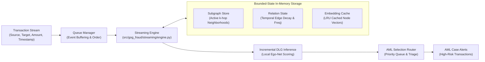

# 05. Streaming Monte Carlo Engine (`stream_mc`)

This document details the architecture of **`stream_mc`**, a dynamic streaming graph anomaly detection and Anti-Money Laundering (AML) risk-scoring engine designed for real-time, low-latency financial transaction streams.

---

## 1. Motivation & Operational Requirements

In production financial environments, transactions arrive as high-velocity event streams (thousands of transactions per second). Standard batch GNN models cannot be retrained continuously from scratch. `stream_mc` solves this with a **bounded-state streaming architecture** satisfying:
1. **Constant-Bound Memory:** Memory footprint must not grow unboundedly with stream length $T$.
2. **Sub-Second Latency:** Per-transaction feature extraction, localized ego-net retrieval, and score inference in $< 50\text{ ms}$.
3. **Temporal Dynamic Updating:** Node embeddings and relation states must update incrementally as new transactions occur.

---

## 2. Streaming Architecture Overview



---

## 3. Core Component Modules

### 3.1 Streaming Engine (`src/gog_fraud/streaming/engine.py`)
The orchestrator managing incoming transaction events:
- Receives transaction tuples: `(src_id, dst_id, amount, timestamp, features)`.
- Fetches active neighborhood subgraphs from `subgraph_store`.
- Computes dynamic node feature updates (e.g., sliding window transaction velocity, amount variance).
- Calls incremental inference and updates the `embedding_cache`.

### 3.2 Bounded-State Subgraph Store (`src/gog_fraud/streaming/subgraph_store.py`)
Maintains localized $k$-hop subgraphs within a bounded sliding window:
- Evicts edges older than $t - \Delta t_{\text{window}}$ to ensure memory bounds:
$$E_{\text{active}}(t) = \{ (u, v, \tau) \in E \mid t - \Delta t_{\text{window}} \le \tau \le t \}$$
- Employs indexed adjacency lists with temporal pointers for $O(1)$ edge insertion and efficient neighborhood extraction.

### 3.3 Dynamic Relation State (`src/gog_fraud/streaming/relation_state.py`)
Tracks behavioral relationship dynamics between accounts:
- Accumulates exponential moving averages (EMA) of transaction intensity:
$$R_{uv}(t) = R_{uv}(t_{\text{prev}}) \cdot e^{-\lambda (t - t_{\text{prev}})} + w_{\text{tx}}$$
where $\lambda$ is the temporal decay factor and $w_{\text{tx}}$ is the normalized transaction weight.
- Detects bursty structuring (smurfing patterns) and sudden fan-out/fan-in spikes.

### 3.4 In-Memory Embedding Cache (`src/gog_fraud/streaming/embedding_cache.py`)
- Least-Recently-Used (LRU) cache storing Level-1 and Level-2 representations.
- Invalidates and recomputes embeddings only for nodes within the 1-hop neighborhood of a new transaction, avoiding full-graph re-encoding.

### 3.5 Selection & Triage Router (`src/gog_fraud/selection/router.py`)
Prioritizes transactions for compliance review:
- Routes transactions into risk tiers based on composite scores:
$$\text{Priority} = w_1 \cdot s_{\text{DLG}} + w_2 \cdot R_{\text{burst}} + w_3 \cdot \text{Amount}$$
- Low-risk transactions pass through without blocking; suspicious transactions trigger immediate alert payloads.

---

## 4. Replay & Simulation Pipeline

To validate streaming performance on historical logs, `stream_mc` includes a deterministic replay runner:

```bash
python -m src.gog_fraud.pipelines.run_streaming_replay \
    --dataset bitcoin_otc \
    --window-size 3600 \
    --batch-size 64
```

This simulates live Kafka streams from static datasets and measures latency, memory consumption, and detection accuracy under realistic operational conditions.
