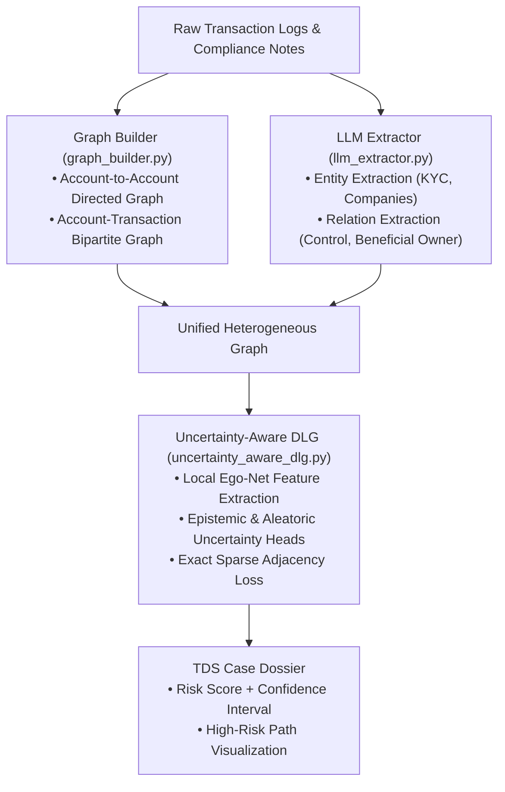

# 06. Transaction Decomposition System (`tds`) & Micro-RAG

This document details the architecture of the **Transaction Decomposition System (`tds`)** and its **Micro-RAG** subsystem, which transforms complex financial transaction flows and unstructured compliance documentation into structured, uncertainty-aware knowledge graphs.

---

## 1. System Motivation & Overview

Financial money laundering networks often disguise illicit fund movements through:
- **Complex Multi-Party Structures:** Intermediary shell accounts, multi-input multi-output transactions (e.g., cryptocurrency CoinJoins), and nested remittance trees.
- **Heterogeneous Context:** Crucial fraud signals reside not only in transaction amounts and timestamps, but also in unstructured AML investigator notes, KYC documents, and counterparty metadata.

`tds` resolves this complexity through a two-tiered pipeline:
1. **Transaction Decomposition:** Decomposes $M$-to-$N$ transaction flows into canonical bipartite (Account $\leftrightarrow$ Transaction) and directed (Account $\to$ Account) graphs.
2. **Micro-RAG & Uncertainty-Aware DLG:** Combines LLM-driven entity/relation extraction from unstructured compliance text with DLG-GNN structural embeddings that explicitly quantify detection uncertainty.

---

## 2. Pipeline Architecture



---

## 3. Subsystem Architecture

The TDS implementation is located in `tests/tds/micro_rag/`:

```text
tests/tds/micro_rag/
├── data_loader.py               # Ingests multi-party financial logs and text notes
├── graph_builder.py             # Constructs directed and bipartite transaction graphs
├── llm_extractor.py             # LLM-based entity and relationship extractor
├── prompts.py                   # Structured extraction prompts for financial entities
├── uncertainty_aware_dlg.py     # DLG model extended with Bayesian / ensemble uncertainty
├── run_phase1.py                # Phase 1: Structural graph building
├── run_phase2_3.py              # Phase 2 & 3: Extraction and GNN embedding
├── run_real_pipeline.py         # End-to-end execution on real-world AML data
└── run_unified_benchmark.py     # Evaluation across synthetic & real fraud topologies
```

### 3.1 Graph Decomposition (`graph_builder.py`)
Standard transaction records often bundle multiple originators and beneficiaries. `graph_builder.py` provides two distinct graph representations:
- **Direct Account-to-Account Projection:** Computes effective flow weights between endpoints using conservation-of-flow heuristics.
- **Bipartite Graph Formulation:** Retains transactions as explicit intermediary nodes:
$$V = V_{\text{accounts}} \cup V_{\text{transactions}}$$
This preserves multi-input/multi-output dependencies without loss of flow integrity.

### 3.2 Uncertainty-Aware DLG (`uncertainty_aware_dlg.py`)
Standard GNN anomaly detectors produce point-estimate anomaly scores $s_i \in [0, 1]$, offering no insight into whether a high score reflects true anomaly (aleatoric risk) or model unfamiliarity due to sparse data (epistemic uncertainty).

`uncertainty_aware_dlg.py` introduces dual output heads:
- **Predicted Anomaly Mean ($\mu_i$):** Expected reconstruction residual.
- **Uncertainty Variance ($\sigma_i^2$):** Variance estimated via Monte Carlo dropout or variational projection:
$$\mathcal{L}_{\text{unc}} = \frac{1}{2 \sigma_i^2} \| \mathbf{x}_i - \hat{\mathbf{x}}_i \|_2^2 + \frac{1}{2} \log \sigma_i^2$$

### 3.3 LLM Extraction & Micro-RAG (`llm_extractor.py`, `prompts.py`)
- Employs structured few-shot prompting to extract high-confidence entities (e.g., Beneficial Owners, Politically Exposed Persons, Shell Companies) from text logs.
- Injects extracted entities as semantic node attributes or typed edges directly into the PyG graph before GNN encoding.

---

## 4. Execution & Pipeline Evaluation

To run the unified TDS pipeline:
```bash
python tests/tds/micro_rag/run_unified_benchmark.py
```

This runs graph construction, entity extraction, DLG embedding, and uncertainty calculation, returning an audit-ready risk dossier for each evaluated account.
