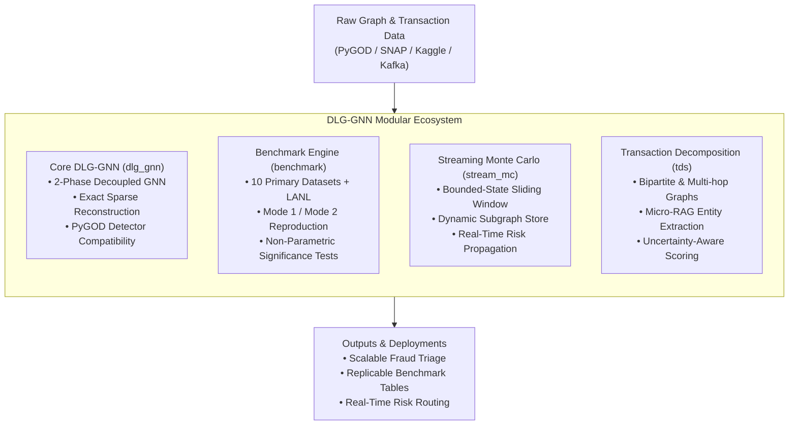

# DLG-GNN Architecture & Source Structure Documentation

Welcome to the architectural documentation for **DLG-GNN** (*Decoupled Local-to-Global Graph Neural Network for Scalable Fraud and Anomaly Detection*).

This directory provides the authoritative reference for the system architecture, source code layout, mathematical foundations, and modular components of the repository. It is designed to help engineers and researchers understand the current implementation and easily reuse its components in other projects.

---

## 1. Quick Navigation

| Document | Topic | Target Audience |
|---|---|---|
| [**01. System Overview**](01_system_overview.md) | High-level system architecture, core design philosophy, and four specialized subprojects (`dlg_gnn`, `benchmark`, `stream_mc`, `tds`) | All engineers, researchers, and architects |
| [**02. Source Tree & Module Guide**](02_directory_and_source_structure.md) | Comprehensive source tree breakdown, package responsibilities (`src/`, `configs/`, `experiments/`, `scripts/`, `tests/`), and layering conventions | Developers modifying or navigating the codebase |
| [**03. DLG-GNN Model Architecture**](03_dlg_gnn_model_architecture.md) | Two-phase decoupled local-to-global learning, ego-net aggregation, and the **Exact Sparse Message Reconstruction** engine ($O(\|E\|d + Nd^2)$ arithmetic, zero $N \times N$ dense allocation) | GNN model developers and algorithmic researchers |
| [**04. Benchmark & Evaluation Engine**](04_benchmark_and_evaluation_engine.md) | Scientific reproducibility harness, 10 primary datasets, 8 detector configurations, Mode 1/Mode 2 reproduction pipelines, Friedman/Wilcoxon statistical testing | Empirical researchers and benchmark authors |
| [**05. Streaming Monte Carlo Engine**](05_streaming_mc_engine.md) | Real-time streaming AML system, bounded-state sliding windows, dynamic relation tracking, subgraph caching, and priority transaction routing | Streaming data engineers and AML systems teams |
| [**06. Transaction Decomposition System**](06_tds_transaction_decomposition.md) | Multi-hop transaction graph decomposition, bipartite graph conversion, LLM-assisted knowledge extraction, and uncertainty-aware micro-RAG | Graph intelligence and LLM-GNN engineers |
| [**07. Cross-Project Reuse Guide**](07_cross_project_integration_guide.md) | **Step-by-step recipes and plug-and-play code snippets** for importing and reusing DLG-GNN components in external projects | External project developers integrating DLG modules |

---

## 2. Core Repository Architecture at a Glance

The `dlg_gnn` codebase is structured around four primary subproject domains, organized symmetrically across tests, reports, and results:

---

## 3. How to Use This Architecture in Other Projects

If you are developing another project and want to reuse parts of `dlg_gnn`:

1. **Need a Scalable Graph Anomaly Detector?**  
   Import the PyGOD-compatible `DLG` class directly. See [03. DLG-GNN Model Architecture](03_dlg_gnn_model_architecture.md) and [07. Cross-Project Reuse Guide (Pattern A)](07_cross_project_integration_guide.md#pattern-a-standalone-pygod-anomaly-detector).
2. **Hit an $O(N^2)$ Memory Wall in Adjacency Reconstruction?**  
   Drop in `exact_reconstruction.py` to calculate exact Frobenius adjacency loss in $O(|E|d + Nd^2)$ without creating dense matrices. See [03. Model Architecture](03_dlg_gnn_model_architecture.md#4-exact-sparse-reconstruction-engine) and [07. Reuse Guide (Pattern B)](07_cross_project_integration_guide.md#pattern-b-reusing-exact-sparse-reconstruction-backend).
3. **Building a Real-Time AML / Fraud Detection Pipeline?**  
   Use `stream_mc`'s bounded sliding-window engine and dynamic relation state manager. See [05. Streaming MC Engine](05_streaming_mc_engine.md) and [07. Reuse Guide (Pattern D)](07_cross_project_integration_guide.md#pattern-d-adopting-the-streaming-monte-carlo-pipeline).
4. **Need Rigorous Scientific Benchmarking for a New GNN?**  
   Use the 10-dataset benchmark harness and automated Friedman/Wilcoxon statistical testing. See [04. Benchmark Engine](04_benchmark_and_evaluation_engine.md) and [07. Reuse Guide (Pattern C)](07_cross_project_integration_guide.md#pattern-c-reusing-the-benchmark-and-statistical-evaluation-engine).

---

## 4. Historical Reference

Historical architectural design notes from earlier project phases (Level 1/2 decoupling, initial MC sketches, nGNN precomputation) are retained in subdirectories:
- [`level1_and_2/`](level1_and_2/): Initial Level-1 and Level-2 decoupling proposal.
- [`mc/`](mc/): Initial Monte Carlo strategy overview.
- [`ngnn/`](ngnn/): Early neighborhood-GNN experimentation plan.
- [`ngnn_precompute/`](ngnn_precompute/): Early precomputation dataflow notes.
