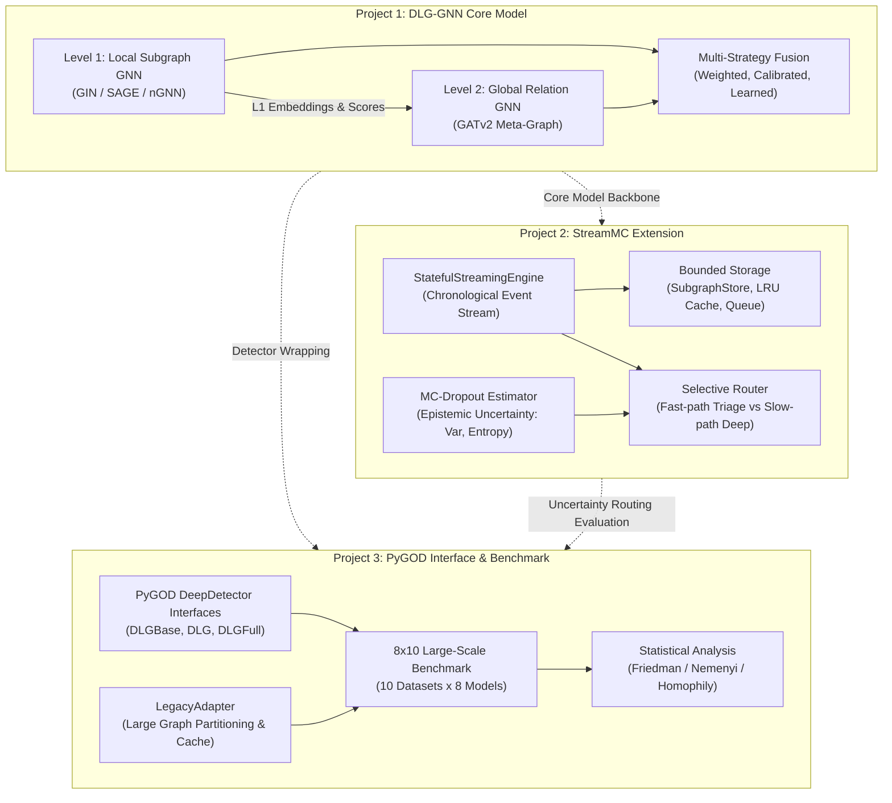
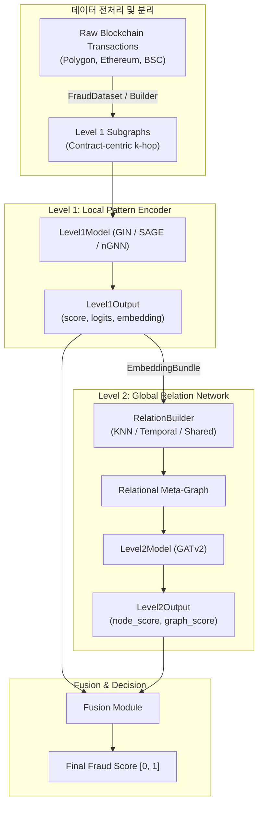
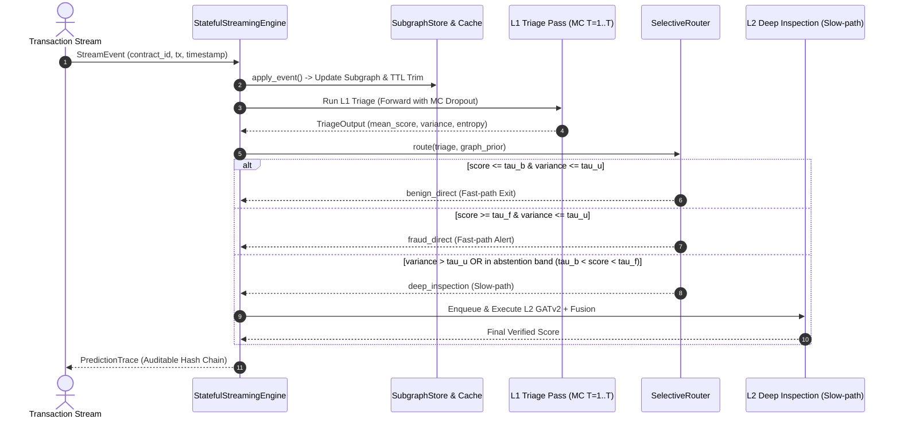
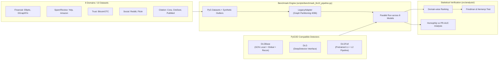
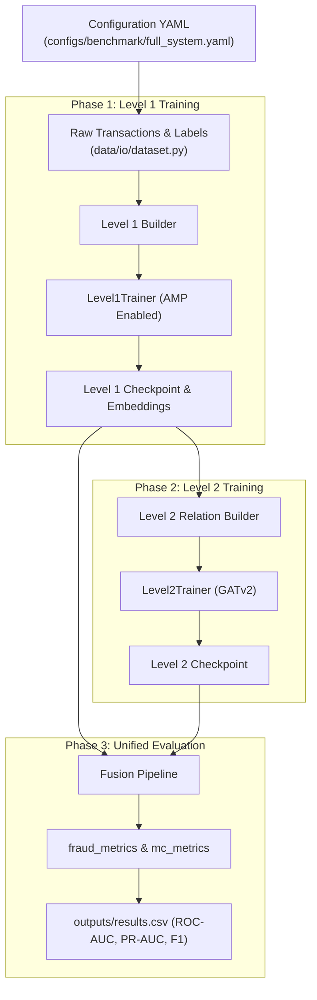
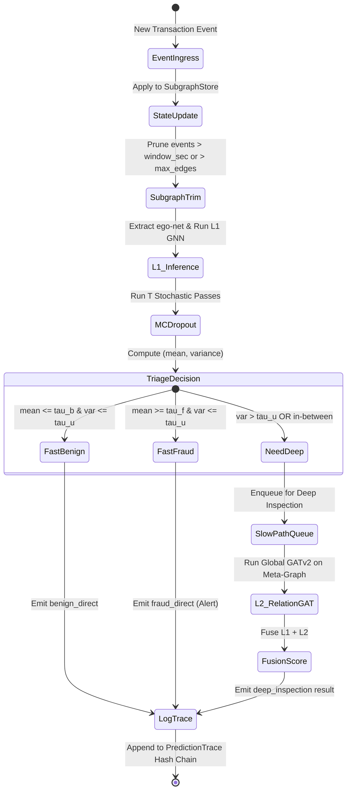

# DLG-GNN 통합 시스템 아키텍처 (System Architecture)

> **문서 버전**: 2.0.0  
> **최종 수정일**: 2026-08-31  
> **문서 위치**: [system_architecture.md](file:///d:/_Work/goat_bank/dlg_gnn/docs/architecture/system_architecture.md)  
> **대상 저장소**: `/mnt/d/_Work/goat_bank/dlg_gnn` (`d:/_Work/goat_bank/dlg_gnn`)  
> **실행 환경**: Python 3.12, PyTorch 2.x, PyTorch Geometric (PyG), PyGOD, CUDA (8GB VRAM 제약 최적화)

---

## 1. 개요 및 3대 핵심 프로젝트

본 저장소(`dlg_gnn`)는 블록체인(Ethereum, Polygon, BSC) 스마트 컨트랙트 및 대규모 그래프 환경에서의 **이상 거래(Fraud / Anomaly) 탐지**를 위해 구축된 차세대 그래프 신경망 연구·엔지니어링 플랫폼입니다. 초기 연구 단계의 2계층 분리형 GNN 모델에서 출발하여, 실시간 스트리밍 인프라 및 대규모 공개 벤치마크 생태계로 확장되었습니다.

현재 단일 저장소 내에서 다음 **3개의 핵심 프로젝트 축**이 긴밀하게 연계되어 구동됩니다:



### 1.1 프로젝트별 핵심 목적 및 역할

| 프로젝트 축 | 주요 목적 및 연구 질문 | 핵심 기술 컴포넌트 |
|---|---|---|
| **Project 1: DLG-GNN Core Model** | **서브그래프 내부 특성과 컨트랙트 간 관계의 분리 학습**<br>단일 거대 그래프의 오버스무딩과 연산 폭증 문제를 해결하기 위해 국소적(Local) 트랜잭션 서브그래프와 광역(Global) 메타-릴레이션을 분리 | `Level1Model`(GIN/SAGE/GAT), `Level1nGNN`(Nested GNN), `RelationBuilder`(KNN/시간/공유엔티티), `Level2Model`(GATv2), `FusionLayer` |
| **Project 2: StreamMC Streaming & Uncertainty Extension** | **자원 제약형 실시간 트랜잭션 스트림 처리 및 불확실성 기반 선택적 추론**<br>초당 대량 유입되는 트랜잭션을 8GB VRAM 한도 내에서 Bounded Memory로 처리하고, MC-Dropout으로 불확실성을 측정하여 고위험/고불확실성 이벤트만 심층 검사(Deep Inspection)로 라우팅 | `StatefulStreamingEngine`, `IncrementalSubgraphStore`, `EmbeddingCache`, `QueueManager`, `MCDropoutEstimator`, `SelectiveRouter` |
| **Project 3: PyGOD Interface & Benchmark Ecosystem** | **학술적 표준화(SCI Q1 투고) 및 범용 그래프 이상탐지 벤치마크**<br>오픈소스 PyGOD의 `DeepDetector` 표준 API를 완벽 지원하며, 8개 도메인 데이터셋과 최신 SOTA 모델(DOMINANT, GADNR, CoLA 등)과의 공정 비교 및 비모수 통계 검정 제공 | `DLGBase`, `DLG`, `DLGFull`, `benchmark_8x10_pipeline.py`, `LegacyAdapter`(OOM 방지 파티셔닝), `add_benchmark_analysis.py` |

---

## 2. 전체 소스 코드 디렉토리 구조 (Source Code Tree Mapping)

저장소의 전체 물리적 코드 구조와 각 모듈의 기능적 역할입니다:

```text
dlg_gnn/
├── configs/                             # 실험 및 환경 설정 (YAML 계층)
│   ├── base.yaml                        # 기본 하이퍼파라미터
│   ├── ablation.yaml                    # 컴포넌트 Ablation 실험 설정
│   ├── mc.yaml / ngnn.yaml              # MC-Dropout 및 nGNN 설정
│   ├── round4_sci_main_frozen.yaml      # SCI 논문 메인 런 고정 설정
│   ├── benchmark/                       # 풀 시스템 벤치마크 (full_system.yaml, strict.yaml 등)
│   ├── legacy/                          # PyGOD Baseline 튜닝 설정 및 best_params/
│   ├── mc/ & ngnn/ & ngnn_mc/           # 모듈별 세부 확장 설정
│   └── sci/ & sci_v2/                   # 엄격한 검증 및 Temporal Split 설정
│
├── docs/                                # 아키텍처 및 작업 보고서
│   ├── architecture/                    # 시스템 및 모듈 설계 문서
│   │   ├── system_architecture.md       # [본 문서] 3대 프로젝트 통합 아키텍처
│   │   ├── DLG_GNN_Architecture_Report.md # 초기 DLG-GNN 심층 리포트
│   │   ├── architecture_skeleton.md     # 아키텍처 인덱스 스켈레톤
│   │   ├── level1_and_2/                # 계층 1, 2 분리 설계 상세
│   │   ├── mc/                          # Monte Carlo 불확실성 모듈 문서
│   │   ├── ngnn/                        # Nested GNN 구조 설계 문서
│   │   └── ngnn_precompute/             # 서브그래프 사전연산 파이프라인
│   └── work_reports/                    # 실험 라운드별 검증 보고서 및 리뷰
│
├── fusion/                              # 스코어 및 불확실성 융합 독립 모듈
│   ├── fixed_fusion.py                  # 고정 가중치 융합
│   ├── learned_fusion.py                # 학습형 로짓 융합 신경망
│   └── uncertainty_fusion.py            # 불확실성 가중 동적 융합
│
├── graphrag/                            # 지식 그래프 증강 및 위험 벡터 추출 (보조)
│   ├── local_kb.py                      # 로컬 컨텍스트 지식 베이스
│   ├── retriever.py                     # 위험 단서 검색기
│   ├── risk_encoder.py                  # 위험 텍스트 인코더
│   └── risk_extractor.py                # 엔티티 위험 속성 추출기
│
├── privacy/                             # 프라이버시 보존 및 유출 공격 방어 모듈
│   ├── leakage_attack.py                # 임베딩 역추적 유출 공격 시뮬레이션
│   ├── noise.py / quantization.py       # 차분 프라이버시(DP) 노이즈 및 벡터 양자화
│   └── vector_codec.py                  # 임베딩 압축 및 복원 코덱
│
├── scripts/                             # 메인 구동 및 오케스트레이션 스크립트
│   ├── benchmark_8x10_pipeline.py       # [Project 3 핵심] 8 데이터셋 x 10 모델 벤치마크
│   ├── benchmark_8x10_results.py        # 벤치마크 결과 집계
│   ├── benchmark_pygod.py               # PyGOD 단독 벤치마크
│   ├── generate_plots.py                # 논문용 ROC/PR 곡선 및 시각화 생성
│   ├── build_temporal_splits.py         # 시간 누수(Temporal Leakage) 방지 분할기
│   ├── audit_dataset_provenance.py      # 데이터 출처 및 감사 스크립트
│   ├── run_all_benchmarks.sh            # 일괄 실행 배치 쉘
│   └── defense_extension/               # 사이버 침해 분석 보조 스크립트
│
├── src/                                 # 핵심 파이썬 소스 루트
│   │
│   ├── gog_fraud/                       # 메인 패키지 (사기 탐지 스택)
│   │   ├── common/                      # 공용 데이터 구조 및 DTO
│   │   │   └── types.py                 # Level1Output, Level1EmbeddingBundle
│   │   ├── data/                        # 데이터 파이프라인 및 로더
│   │   │   ├── io/                      # FraudDataset, StreamingDataset, CacheStore
│   │   │   ├── level1/                  # L1 PyG 그래프 빌더 및 데이터셋
│   │   │   ├── level2/                  # L2 관계 그래프 빌더 (KNN/시간/공유엔티티)
│   │   │   ├── preprocessing/           # 피처 정규화 및 nGNN 사전 추출
│   │   │   └── splits/                  # 시계열/계층형 데이터 분할기
│   │   ├── models/                      # 신경망 모델 정의
│   │   │   ├── level1/                  # Level1Model (GIN), Level1GNN (SAGE/GAT)
│   │   │   ├── level2/                  # Level2Model (GATv2 관계 메타-그래프)
│   │   │   ├── pygod/                   # [Project 3] DLGBase, DLG, DLGFull, GADNR
│   │   │   └── extensions/              # 모델 확장 기능
│   │   │       ├── mc/                  # [Project 2] MCDropoutEstimator, Config
│   │   │       └── ngnn/                # [Project 1] Level1nGNN, NestedEncoder
│   │   ├── training/                    # 모델 훈련 루프
│   │   │   └── loops/                   # Level1Trainer, Level2Trainer (AMP 지원)
│   │   ├── pipelines/                   # 엔드-투-엔드 파이프라인
│   │   │   ├── run_fraud_benchmark.py   # [Project 1/3] 메인 통합 벤치마크 런
│   │   │   ├── run_streaming_replay.py  # [Project 2] 스트리밍 시뮬레이션 런
│   │   │   ├── fusion.py                # 4단계 융합 파이프라인
│   │   │   ├── run_mc_benchmark.py      # MC 불확실성 정량화 실험
│   │   │   ├── run_ablation_study.py    # 컴포넌트 기여도 분석
│   │   │   └── train_level1.py/level2.py# 단계별 단독 훈련
│   │   ├── streaming/                   # [Project 2 핵심] 스트리밍 인프라
│   │   │   ├── engine.py                # StatefulStreamingEngine & PredictionTrace
│   │   │   ├── subgraph_store.py        # IncrementalSubgraphStore (Window & TTL)
│   │   │   ├── embedding_cache.py       # EmbeddingCache (LRU + TTL)
│   │   │   ├── queue_manager.py         # QueueManager (Deep-path 우선순위 큐)
│   │   │   ├── relation_state.py        # IncrementalRelationState (동적 관계망)
│   │   │   └── checkpoint.py            # 스트리밍 상태 영속화
│   │   ├── selection/                   # [Project 2 핵심] 선택적 추론 라우팅
│   │   │   ├── router.py                # SelectiveRouter (Triage -> Fast/Slow Path)
│   │   │   └── thresholds.py            # 동적 임계값 산출 정책
│   │   ├── evaluation/                  # 성능 지표 평가
│   │   │   ├── benchmark.py             # BenchmarkResult, BenchmarkTable
│   │   │   ├── fraud_metrics.py         # AUC, Best-F1, PR 스위프 (NaN-safe)
│   │   │   └── mc_metrics.py            # ECE, NLL, Selective Prediction 지표
│   │   ├── adapters/                    # 레거시 및 외부 도구 호환
│   │   │   └── legacy_adapter.py        # PyGOD 모델 래퍼 & 대형 그래프 분할 처리
│   │   └── extensions/defense/          # 보안 침해 데이터셋 어댑터 (Theia, LANL)
│   │
│   ├── analysis/                        # [Project 3 핵심] 사후 분석 및 통계 검정
│   │   ├── add_benchmark_analysis.py    # Friedman/Nemenyi 검정 및 도메인별 순위 산출
│   │   ├── plot_benchmark_analysis.py   # Critical Distance 및 Homophily 산점도
│   │   ├── compute_homophily.py         # 그래프 에지 동질성 및 통계량 계산
│   │   └── utils.py                     # MODEL_FAMILY_MAP 및 도메인 분류
│   │
│   ├── profiling/                       # [Project 2] 실시간 지연 및 자원 프로파일러
│   │   └── streaming_profiler.py        # Cold/Steady-state Latency, VRAM, RSS 측정
│   ├── inference/                       # 인퍼런스 보조
│   │   └── mc_streaming_inference.py    # 스트리밍 실시간 MC 인퍼런스 래퍼
│   ├── risk_injection/                  # GraphRAG 위험 가중치 주입
│   │   ├── fusion_layer.py              # 불확실성 기반 외부 위험 융합
│   │   └── risk_vectorizer.py           # 위험 단서 수치 벡터화
│   ├── export/                          # 논문용 표 및 결과 출력 (paper_table_exporter)
│   └── validation/                      # 데이터 누수 탐지 및 컨텍스트 검증 (leakage_detector)
│
├── outputs/ & results/                  # 실험 수치, CSV, JSON 캐시 출력
├── tables/ & figures/                   # 논문 수록용 표 및 다이어그램 이미지
└── tests/                              # 단위 테스트 모음
```

---

## 3. Subsystem 1: DLG-GNN Core Architecture

DLG-GNN(Decoupled Layered Graph GNN)은 단일 거대 그래프에서 발생하는 계산 복잡도와 오버스무딩(Over-smoothing) 문제를 해결하기 위해 설계된 **2계층 분리형 이상 탐지 아키텍처**입니다.



### 3.1 인터페이스 표준화 (`common/types.py`)
모든 서브시스템 간의 데이터 통신은 정형화된 데이터클래스를 통해 이루어집니다:
- **`Level1Output`**:
  - `graph_id`: 개별 서브그래프 식별자 텐서
  - `embedding`: 국소적 구조/특성이 요약된 고차원 표현 벡터 (`[batch_size, hidden_dim]`)
  - `logits`: 원시 로짓 (`[batch_size, 1]`)
  - `score`: Sigmoid 활성화 확률 (`[0, 1]`)
  - `label`: 정답 레이블 (지도학습 시)
  - `aux`: 어텐션 가중치, MC 불확실성 등 부가 정보 딕셔너리
- **`Level1EmbeddingBundle`**: Level 1에서 사전 계산된 임베딩을 파일 또는 메모리로 Level 2 및 스트리밍 엔진에 전달하기 위한 직렬화 컨테이너.

### 3.2 Level 1 Local Subgraph Encoder
- **주요 모듈**: `src/gog_fraud/models/level1/model.py` (`Level1Model`), `level1_gnn.py` (`Level1GNN`)
- **기능**: 특정 스마트 컨트랙트 중심의 $k$-hop 거래 서브그래프(Neighborhood)를 입력으로 받아, 내부 노드 피처(가스비, 거래액, 호출 패턴)와 구조적 토폴로지를 인코딩.
- **백엔드 옵션**:
  - `GIN` (Graph Isomorphism Network): 다중 그래프 구조 판별에 최적화
  - `GraphSAGE / GAT`: 대규모 이웃 샘플링 및 어텐션 가중 집계
  - `Level1nGNN`: 노드별 Rooted Subgraph를 추출하여 부분 그래프 내 메시지 패싱을 수행하는 중첩(Nested) 인코더 (`extensions/ngnn/`)

### 3.3 Dynamic Level 2 Relational Graph Builder
- **주요 모듈**: `src/gog_fraud/data/level2/relation_builder.py` (`RelationBuilder`)
- **기능**: Level 1에서 추출된 각 서브그래프의 임베딩을 노드 피처로 삼아, 상위 레벨의 **관계 메타-그래프(Meta-Graph)** 를 동적으로 구축.
- **연결 모드**:
  1. `embedding_knn`: 임베딩 코사인 유사도 기준 상위 $k$개 이웃 연결 (자금세탁 유사 수법 탐지)
  2. `temporal_window`: 거래 발생 시점 차이가 $\Delta t$ 이내인 트랜잭션 간 연결
  3. `shared_entity`: 동일 주소, 라벨, 체인을 공유하는 개체 간 명시적 연결

### 3.4 Level 2 Global Relational GNN
- **주요 모듈**: `src/gog_fraud/models/level2/model.py` (`Level2Model`)
- **기능**: `GATv2Conv`(다중 헤드 어텐션) 레이어를 통해 컨트랙트 간의 자금 흐름 네트워크를 학습.
- **이중 헤드 구조 (Dual Head)**:
  - **Node-level Head**: 개별 컨트랙트 단위의 이상 거래 점수 출력
  - **Graph-level Head**: 전체 메타-그래프 또는 캠페인 단위의 조직적 사기 여부 점수 출력

### 3.5 Fusion Layer
- **주요 모듈**: `src/gog_fraud/pipelines/fusion.py`, `fusion/`
- Level 1(국소 패턴)과 Level 2(광역 관계)의 점수를 결합:
  - **WeightedSumFusion**: $S = \alpha S_{L1} + (1-\alpha) S_{L2}$
  - **CalibratedFusion**: 온도 스케일링(Platt Scaling) 후 결합
  - **LearnedFusion**: MLP를 통해 두 계층의 로짓과 통계량을 입력받아 비선형 융합
  - **UncertaintyFusion**: MC 불확실성($U_{mc}$)에 따라 가중치 동적 조율

---

## 4. Subsystem 2: StreamMC Streaming & Uncertainty Engine

StreamMC 프로젝트는 정적(Batch) 훈련 완료 모델을 실제 24/7 블록체인 거래 스트림 환경에 배포할 때 발생하는 **지연 시간(Latency), 메모리 폭증(OOM), 계산 비용** 문제를 해결하기 위해 구축된 핵심 서브시스템입니다.



### 4.1 Bounded Storage 아키텍처 (`src/gog_fraud/streaming/`)
스트리밍 환경에서 노드와 엣지가 무한정 증가하는 것을 방지하기 위해 엄격한 **메모리 상한(Bounded Resource)** 기법을 적용합니다:
- **`IncrementalSubgraphStore`**:
  - `temporal_window_seconds`: 특정 시간 창(예: 3600초) 이전의 거래 엣지 자동 제거
  - `max_nodes_per_contract`, `max_edges_per_contract`: 계약당 메모리 상한 초과 시 FIFO 기반 자동 퇴출(Trimming)
  - `contract_ttl_seconds`: 비활성 컨트랙트 상태의 자동 만료
- **`EmbeddingCache`**:
  - Level 1 임베딩을 LRU(Least Recently Used) 방식으로 캐싱하여 중복 연산 방지
- **`QueueManager`**:
  - 심층 검사(Deep Inspection) 대상 이벤트를 버퍼링하고 부하에 따라 우선순위 스케줄링
- **`IncrementalRelationState`**:
  - 실시간으로 들어오는 거래에 따라 Level 2 메타 릴레이션 엣지를 증분(Incremental) 업데이트

### 4.2 Monte Carlo (MC) Dropout Uncertainty Estimator
- **주요 모듈**: `src/gog_fraud/models/extensions/mc/mc_dropout.py` (`MCDropoutEstimator`), `src/inference/mc_streaming_inference.py`
- **알고리즘**:
  1. 추론 시점에도 드롭아웃 레이어를 활성화 (`model.train()`, evaluation context)
  2. $T$회(예: $T=8$ 또는 $T=10$)의 확률적 순전파(Stochastic Forward Passes) 수행
  3. 결과 텐서 $\hat{y}_1, \dots, \hat{y}_T$로부터 다음 지표 산출:
     - **평균 예측값 (Mean Score)**: $\mu = \frac{1}{T}\sum_{t=1}^T \hat{y}_t$
     - **예측 분산 / 인식론적 불확실성 (Epistemic Uncertainty)**: $\sigma^2 = \frac{1}{T}\sum_{t=1}^T (\hat{y}_t - \mu)^2$
     - **예측 엔트로피 (Predictive Entropy)**: $H = -\mu \log \mu - (1-\mu)\log(1-\mu)$

### 4.3 선택적 추론 라우터 (`src/gog_fraud/selection/router.py`)
불필요한 Level 2 계산을 회피하여 연산 비용과 지연 시간을 대폭 절감합니다:
- **라우팅 결정 규칙**:
  $$\text{Route} = \begin{cases} 
  \text{benign\_direct}, & \text{if } \mu \le \tau_b \text{ and } \sigma^2 \le \tau_u \\
  \text{fraud\_direct}, & \text{if } \mu \ge \tau_f \text{ and } \sigma^2 \le \tau_u \\
  \text{deep\_inspection}, & \text{if } \sigma^2 > \tau_u \text{ or } \tau_b < \mu < \tau_f \text{ or } \mu \ge \tau_r
  \end{cases}$$
- **결과**: 전체 유입 이벤트의 50% 이상을 Level 1에서 조기 종료(Early-exit)하면서도 사기 탐지 Recall을 100% 보존.
- **감사 추적 (`PredictionTrace`)**:
  - 각 이벤트별 지연 시간(Triage Latency, Deep Latency), 결정 사유, 모델 버전, SHA-256 해시를 기록하여 감사(Audit) 무결성 보장.

---

## 5. Subsystem 3: PyGOD Interface & Benchmark Ecosystem

Project 3은 학술적 객관성과 재현성을 입증하기 위해 그래프 이상탐지 분야의 대표 오픈소스인 **PyGOD(Python Graph Outlier Detection)** 인터페이스를 구현하고, 대규모 표준 벤치마크 및 통계 검정을 자동화한 프레임워크입니다.



### 5.1 PyGOD 표준 감지기 클래스 (`src/gog_fraud/models/pygod/`)
- **`DLGBase`** (`dlg_base.py`):
  - Local GCN(이웃 토폴로지 인코딩)과 Global GCN(광역 연결 인코딩)을 결합
  - 특성 재구성 오차($\|x - \hat{x}\|^2$) 및 구조 재구성 오차($\|s - \hat{s}\|^2$)의 가중 합으로 이상치 점수 산출
- **`DLG`** (`dlg.py`):
  - PyGOD의 `DeepDetector`를 상속하여 `.fit(data)`, `.decision_function(data)` 인터페이스를 완벽 준수
- **`DLGFull`** (`dlg_full.py`):
  - L1 사전 훈련 모델의 임베딩을 원본 피처와 결합하여 L2 전역 탐지를 수행하는 2단계 완전 파이프라인 감지기

### 5.2 대규모 8x10 벤치마크 파이프라인 (`scripts/benchmark_8x10_pipeline.py`)
- **대상 모델 8종**:
  - Reconstruction 계열: `DOMINANT`, `AnomalyDAE`
  - Contrastive 계열: `CoLA`, `CONAD`
  - SOTA Neighborhood Reconstruction: `GADNR` (2024 최신 기법)
  - One-Class 계열: `OCGNN`
  - 제안 기법: `DLG-Base`, `DLG` (DLGFull)
- **대상 데이터셋 10종**:
  1. `Elliptic` (203,769 노드): 비트코인 자금세탁(AML) 실제 데이터
  2. `DGraphFin` (3,700,550 노드): 초대형 금융 대출 사기
  3. `Yelp` (716,847 노드): 리뷰 스팸 탐지
  4. `Amazon` (11,944 노드): 전자상거래 리뷰 사기
  5. `BitcoinOTC` (5,881 노드): 신뢰 네트워크 이상 탐지
  6. `Flickr` (89,250 노드): 스팸 계정 탐지
  7. `Reddit` (232,965 노드): 트롤/시빌 공격 탐지
  8. `Cora` (2,708 노드), `CiteSeer` (3,327 노드), `PubMed` (19,717 노드): 인용 네트워크 표준 베이스라인

### 5.3 대형 그래프 메모리 보호 (`adapters/legacy_adapter.py`)
8GB VRAM 환경에서 수십만~수백만 노드의 그래프를 처리하기 위해 `LegacyAdapter`에 고도화된 파티셔닝 전략을 내장:
- `max_nodes: 4096`: 4,096 노드 초과 시 자동 분할
- `large_graph_mode: "partition"`: 메타 파티션 단위로 분할하여 독립 추론 후 결과 병합
- `aggregation_method: "max" | "topk_mean"`: 파티션별 이상 점수 집계

### 5.4 통계적 유의성 검정 (`src/analysis/`)
단순한 평균 점수 나열에 그치지 않고 학술적 엄밀성을 확보:
- **`add_benchmark_analysis.py`**:
  - 도메인별(Financial, Social, Citation 등) 평균 순위 계산
  - **Friedman 비모수 검정**: 전체 모델 간 성능 차이의 통계적 유의성 확인 ($p < 0.05$)
  - **Nemenyi Post-hoc 검정**: 모델 쌍 간 임계 거리(Critical Distance, CD) 도출
- **`compute_homophily.py`**:
  - 그래프의 에지 동질성(Edge Homophily)과 이상치 비율을 계산하여, 이질적(Heterophilic) 그래프에서 DLG의 구조적 우수성을 규명

---

## 6. 보조 및 보안 확장 서브시스템

### 6.1 GraphRAG 위험 주입 계층 (`graphrag/`, `src/risk_injection/`)
- 블록체인 거래 그래프 외에 외부 위협 인텔리전스(로컬 지식 베이스, 뉴스, 블랙리스트)로부터 위험 단서를 수집.
- `FusionLayer` (`risk_injection/fusion_layer.py`):
  - 시간 경과에 따른 정보 신선도 감쇄($e^{-\Delta t / \tau}$) 적용
  - GNN의 MC 불확실성($U_{mc}$)이 높을수록 외부 지식 베이스의 단서에 더 높은 가중치를 부여하는 적응형 융합

### 6.2 프라이버시 보호 계층 (`privacy/`)
- 분산 노드 또는 외부 검증자에게 노드 임베딩을 노출할 때 발생하는 **멤버십 추론 공격(MIA) 및 특성 유출(Feature Leakage)** 방어.
- `vector_codec.py`: 임베딩 벡터 양자화(Quantization) 및 차분 프라이버시(DP) 가우시안 노이즈 주입.
- `leakage_attack.py`: 디코더 기반 복원 공격 시뮬레이션을 통해 임베딩의 안전성 평가.

### 6.3 실시간 사이버 침해 방어 확장 (`src/gog_fraud/extensions/defense/`)
- 금융 사기를 넘어 실시간 시스템 침해 로그(Host/Network Audit Log) 분석으로 확장.
- DARPA Theia(시스템 감사 provenance 그래프) 및 LANL RedTeam(엔터프라이즈 침해 흔적) 파싱 어댑터 제공.

---

## 7. 시스템 데이터 흐름 및 상태 전이 (End-to-End Workflows)

### 7.1 오프라인 훈련 및 평가 파이프라인


### 7.2 실시간 스트리밍 인퍼런스 상태 전이 다이어그램


---

## 8. 설정 관리 시스템 (Configuration System)

모든 실험과 파이프라인은 `configs/` 디렉토리의 계층적 YAML 설정을 통해 제어됩니다.

```text
configs/
├── benchmark/
│   ├── full_system.yaml        # 4가지 설정(Legacy, L1, L1+L2, Full) 일괄 실행
│   ├── strict.yaml             # 엄격한 재현성 및 시간 분할 검증
│   ├── polygon_full.yaml       # Polygon 체인 전용 런
│   └── ethereum_full.yaml      # Ethereum 체인 전용 런
├── legacy/                     # PyGOD baseline 모델별 하이퍼파라미터
│   └── best_params/            # Optuna 튜닝된 최적 파라미터 캐시
├── mc/                         # MC-Dropout 샘플 수(mc_samples) 및 dropout_p 설정
├── ngnn/                       # nGNN hop수, readout 방식 설정
└── sci/ & sci_v2/              # 저널 투고용 동결(Frozen) 벤치마크 설정
```

### `full_system.yaml` 핵심 스키마 예시
```yaml
setting: "full_system"

dataset:
  transactions_root: "../_data/dataset/transactions"
  labels_path: "../_data/dataset/labels.csv"
  chain: "polygon"
  auto_split: true
  train_ratio: 0.70
  val_ratio: 0.15
  test_ratio: 0.15

# 파이프라인 실행 스위치
run_legacy: true              # PyGOD Baseline (DOMINANT 등) 실행
run_revision_l1: true         # Level 1 단독 훈련 및 평가
run_revision_l1_l2: true      # Level 1 + Level 2 융합 훈련 및 평가
run_revision_full: true       # Fusion 앙상블 및 스트리밍 시뮬레이션

level1:
  model_type: "gin"           # gin | sage | gat
  hidden_dim: 64
  num_layers: 3
  epochs: 30
  lr: 0.001
  pos_weight: 5.0             # 클래스 불균형 완화

level2:
  relation_mode: "embedding_knn" # embedding_knn | temporal_window
  k_neighbors: 5
  hidden_dim: 64
  epochs: 30
  lr: 0.001

streaming:
  mode: "virtual"
  window_seconds: 3600
  tau_b: 0.35
  tau_f: 0.65
  tau_u: 0.05
```

---

## 9. 주요 실행 커맨드 및 워크플로우

```bash
# 1. 가상환경 활성화 (프로젝트 루트)
source .venv/bin/activate

# 2. [Project 1] DLG-GNN 통합 벤치마크 (Legacy + L1 + L2 + Fusion)
python -m gog_fraud.pipelines.run_fraud_benchmark \
    --config configs/benchmark/full_system.yaml

# 3. [Project 2] StreamMC 실시간 스트리밍 시뮬레이션 및 선택적 추론
python src/gog_fraud/pipelines/run_streaming_replay.py \
    --config configs/benchmark/full_system.yaml

# 4. [Project 3] 8대 도메인 x 10개 모델 대규모 PyGOD 벤치마크
python scripts/benchmark_8x10_pipeline.py

# 5. [Project 3] 벤치마크 결과 사후 분석 및 Friedman/Nemenyi 검정
python src/analysis/add_benchmark_analysis.py
python src/analysis/plot_benchmark_analysis.py
python scripts/generate_plots.py
```

---

## 10. 결론 및 향후 확장 계획

DLG-GNN 플랫폼은 본 시스템 아키텍처 문서를 바탕으로 다음 세 가지 방향으로 지속 확장됩니다:
1. **Model Backbone 고도화**: 단순 KNN 메타-그래프를 넘어 동적 Temporal GNN(TGN) 및 이종 그래프(Heterogeneous Graph) 릴레이션 지원.
2. **Selective Inference 정밀화**: 고정 분위수 임계값 대신 Conformal Prediction 기반의 위험 제어 예측 세트(Risk-Controlling Prediction Sets) 도입.
3. **PyGOD 공식 패키지 기여**: `DLG` 및 `DLGFull` 모듈을 공식 PyGOD 라이브러리 풀 리퀘스트(PR)로 제출하여 오픈소스 생태계 기여.
