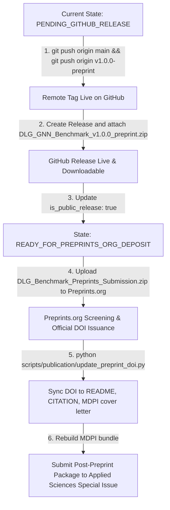

# Walkthrough — DLG Benchmark Publication Preparation Round P4

## 1. Executive Summary

Round P4 of the **DLG Benchmark Publication Preparation** has been completed in accordance with:
- Work Order: [`dlg_gnn/docs/work_reports/benchmark/221_p4/DLG_Benchmark_Publication_Preparation_Round_P4_Work_Order.md`](file:///d:/_Work/goat_bank/dlg_gnn/docs/work_reports/benchmark/221_p4/DLG_Benchmark_Publication_Preparation_Round_P4_Work_Order.md)
- Background Discussion: [`dlg_gnn/docs/work_reports/benchmark/221_p4/background.md`](file:///d:/_Work/goat_bank/dlg_gnn/docs/work_reports/benchmark/221_p4/background.md)

### Strict Boundary Compliance:
- `NEW PRIMARY RUNS = 0`
- `NEW CONTROL RUNS = 0`
- `MODEL / BENCHMARK CHANGES = 0`
- **Frozen raw benchmark SHA-256:** `39a497efe81a0d2630d8817e653d35b01bbb141de4a8d008a46a8c13f1c8375c` (verified immutable)
- **Frozen support matrix SHA-256:** `c58dbca9a9e1ed14dfc025075820a3ad745f6cb70be77764c265d90af3522914` (verified immutable)
- **Authoritative Project State:** **`PENDING_GITHUB_RELEASE`** (transitions to `READY_FOR_PREPRINTS_ORG_DEPOSIT` upon author attaching release asset on GitHub).

---

## 2. Key Accomplishments in Round P4

### 2.1 Abstract Editorial Refinement & Clean Submission Bundles Rebuild
- **Wording Refinement (Section 11):** Updated `"local augmentation proved strongly dataset-dependent"` to `"local augmentation showed strong dataset dependence"`.
- **Parity & Word Count:** Applied simultaneously to Preprints and MDPI sources. Word count remains concise at 188 substantive words ($\le 200$ words).
- **Clean 4-Pass Recompilation:**
  - **Preprints.org PDF:** [`publication/benchmark/preprints/DLG-Benchmark-Preprint.pdf`](file:///d:/_Work/goat_bank/dlg_gnn/publication/benchmark/preprints/DLG-Benchmark-Preprint.pdf) (501.6 KB, 32 pages, clean build, 0 errors).  
    *SHA-256:* `26B289207E598676C40A342E0D4E6D2DB6FA2A28E0DAE4829EC5A123FF7B62D3`
  - **Preprints Submission Archive:** [`publication/benchmark/preprints/DLG_Benchmark_Preprints_Submission.zip`](file:///d:/_Work/goat_bank/dlg_gnn/publication/benchmark/preprints/DLG_Benchmark_Preprints_Submission.zip) (0.78 MB).  
    *SHA-256:* `ABFC66B5925FB17BF680B6FE1F3CCD01050AE84A4F5B20AA91F5C220B431F0FF`
  - **MDPI Applied Sciences PDF:** [`publication/benchmark/mdpi/DLG-Benchmark.pdf`](file:///d:/_Work/goat_bank/dlg_gnn/publication/benchmark/mdpi/DLG-Benchmark.pdf) (312.0 KB, 30 pages, clean build, 0 errors).  
    *SHA-256:* `B74B72B2575BC530D9F25B21D08E8946349957F24CA2E82686D83C0E05A715C0`
  - **MDPI Submission Archive:** [`publication/benchmark/mdpi/DLG_Benchmark_MDPI_Submission.zip`](file:///d:/_Work/goat_bank/dlg_gnn/publication/benchmark/mdpi/DLG_Benchmark_MDPI_Submission.zip) (1.08 MB).  
    *SHA-256:* `A585356870446167BC7D0239B387213D11832D75F9B9C1CC9373F8B1ABBEED3B`

---

### 2.2 Root Repository Landing Page Transformation
- Transformed [`README.md`](file:///d:/_Work/goat_bank/dlg_gnn/README.md) into an authoritative Benchmark Reproduction Landing Page.
- Features paper title, verified author ORCIDs, publication state, Mode 1 instant reproduction command, Mode 2 full pipeline instructions, dataset provenance table, frozen cryptographic hashes, BibTeX entry, and foundational DLG paper DOI (`10.20944/preprints202609.0848.v1`).
- Preserved historical GoatBank architecture under a designated bottom section.

---

### 2.3 Installation & Packaging Closure
- Created [`INSTALL.md`](file:///d:/_Work/goat_bank/dlg_gnn/INSTALL.md) with clean clone instructions: `https://github.com/Sam-7878/dlg_gnn.git`.
- Created [`LICENSE`](file:///d:/_Work/goat_bank/dlg_gnn/LICENSE) with MIT license attributed to SeongSu Park and Ki-Hyung Kim.
- Created [`environment.yml`](file:///d:/_Work/goat_bank/dlg_gnn/environment.yml) and automated environment diagnostic script [`scripts/verify_environment.py`](file:///d:/_Work/goat_bank/dlg_gnn/scripts/verify_environment.py).
- Restored benchmark runners and pipeline dependencies:
  - Mode 1 reproduction script: [`scripts/reproduce_frozen_artifacts.py`](file:///d:/_Work/goat_bank/dlg_gnn/scripts/reproduce_frozen_artifacts.py) (0.40s runtime, 0 errors).
  - Primary runner: [`experiments/benchmark/run_sci_round5_final.py`](file:///d:/_Work/goat_bank/dlg_gnn/experiments/benchmark/run_sci_round5_final.py).
  - Sensitivity runner: [`experiments/benchmark/run_capacity_controls_m3.py`](file:///d:/_Work/goat_bank/dlg_gnn/experiments/benchmark/run_capacity_controls_m3.py).
  - Mathematical documentation: [`docs/math/exact_sparse_reconstruction.md`](file:///d:/_Work/goat_bank/dlg_gnn/docs/math/exact_sparse_reconstruction.md).

---

### 2.4 Environment Versioning
Split environment specifications to prevent drift between historical run environments and reproduction environments:
1. [`outputs/benchmark/manuscript_m5/provenance/frozen_execution_environment.json`](file:///d:/_Work/goat_bank/dlg_gnn/outputs/benchmark/manuscript_m5/provenance/frozen_execution_environment.json) (historical environment: Python 3.12.13, PyTorch 2.5.1+cu121, PyG 2.7.0, PyGOD 1.1.0).
2. [`outputs/benchmark/manuscript_m5/provenance/current_reproduction_environment.json`](file:///d:/_Work/goat_bank/dlg_gnn/outputs/benchmark/manuscript_m5/provenance/current_reproduction_environment.json) (active reproduction environment: Python 3.12.13, verified against clean unpack).

---

### 2.5 Clean Public Release Package Build & Unpack Verification
- Built clean release archive: [`outputs/benchmark/manuscript_m5/release/DLG_GNN_Benchmark_v1.0.0_preprint.zip`](file:///d:/_Work/goat_bank/dlg_gnn/outputs/benchmark/manuscript_m5/release/DLG_GNN_Benchmark_v1.0.0_preprint.zip) (0.49 MB, 173 files).  
  *SHA-256:* `94513B8786F92FDFC0FEEBFECFC02DE9F0E6F6613215C5341EB6DE3149337BE9`
- Completely removed obsolete `DLG_GNN_Benchmark_M5_Release.zip`.
- Automated clean-unpack test extracted the archive into an isolated scratch directory and reproduced all manuscript LaTeX tables and statistical tests with 0 errors in 0.40 seconds.
- Verified 0 occurrences of banned strings (`goat-bank`, `Under Review`, `d:\_work`, `/mnt/d/_work/`).

---

### 2.6 Truthful Release Metadata & Network-Aware Gates
- Configured [`outputs/benchmark/manuscript_m5/release/release_metadata.json`](file:///d:/_Work/goat_bank/dlg_gnn/outputs/benchmark/manuscript_m5/release/release_metadata.json):
  `"is_public_release": false`, `"release_state": "prepared_for_public_release"`, `"git_tag": "v1.0.0-preprint"`, `"commit_sha": "12a38625e7909ea0892ed495fd5793bfb1a2443b"`.
- Configured [`CITATION.cff`](file:///d:/_Work/goat_bank/dlg_gnn/CITATION.cff) with canonical author ORCIDs.
- Reconciled Round P3 Reports 05 and 08 to state `PENDING_EXTERNAL_RELEASE`.
- Implemented network-aware external gate [`tests/benchmark/publication_p4/test_github_remote_status_gate.py`](file:///d:/_Work/goat_bank/dlg_gnn/tests/benchmark/publication_p4/test_github_remote_status_gate.py).

---

### 2.7 Git Commit & Annotated Release Tag
- Staged and committed all Round P4 changes:  
  **Commit SHA:** `12a38625e7909ea0892ed495fd5793bfb1a2443b`  
  *Message:* `feat(benchmark): finalize publication round P4 release assets, landing page, and audit test suites`
- Created annotated Git tag:  
  **Tag:** `v1.0.0-preprint`  
  *Message:* `DLG-GNN Benchmark v1.0.0-preprint release`

---

## 3. Round P4 Audit Reports Summary

The following seven audit reports have been generated in [`publication/benchmark/reports/`](file:///d:/_Work/goat_bank/dlg_gnn/publication/benchmark/reports/):

1. [`01_p4_public_release_content_audit.md`](file:///d:/_Work/goat_bank/dlg_gnn/publication/benchmark/reports/01_p4_public_release_content_audit.md) — Release package contents, file counts, hashes, clean unpack test, 0 banned strings.
2. [`02_p4_root_readme_reproduction_landing_audit.md`](file:///d:/_Work/goat_bank/dlg_gnn/publication/benchmark/reports/02_p4_root_readme_reproduction_landing_audit.md) — Landing page sections, author ORCIDs, Mode 1/2 instructions, honest release claims.
3. [`03_p4_release_metadata_remote_state_audit.md`](file:///d:/_Work/goat_bank/dlg_gnn/publication/benchmark/reports/03_p4_release_metadata_remote_state_audit.md) — Truthful `prepared_for_public_release` status, elimination of premature PASS.
4. [`04_p4_environment_versioning_audit.md`](file:///d:/_Work/goat_bank/dlg_gnn/publication/benchmark/reports/04_p4_environment_versioning_audit.md) — Two-tier environment split, conda/pip instructions, verification scripts.
5. [`05_p4_github_tag_release_external_verification.md`](file:///d:/_Work/goat_bank/dlg_gnn/publication/benchmark/reports/05_p4_github_tag_release_external_verification.md) — External unauthenticated remote check results, step-by-step author release instructions.
6. [`06_p4_preprints_final_freeze_audit.md`](file:///d:/_Work/goat_bank/dlg_gnn/publication/benchmark/reports/06_p4_preprints_final_freeze_audit.md) — Preprints.org submission bundle freeze, abstract wording, 32-page clean build verification.
7. [`07_p4_final_go_live_readiness.md`](file:///d:/_Work/goat_bank/dlg_gnn/publication/benchmark/reports/07_p4_final_go_live_readiness.md) — Definitive project readiness status (`PENDING_GITHUB_RELEASE`), transition criteria to `READY_FOR_PREPRINTS_ORG_DEPOSIT`.

---

## 4. Automated Test Suite Verification Results

```bash
wsl /mnt/d/_Work/goat_bank/.venv/bin/pytest tests/benchmark/publication_p1 tests/benchmark/publication_p2 tests/benchmark/publication_p3 tests/benchmark/publication_p4
```

**Results:**
- **Collected:** 107 items
- **Passed:** **103 passed** (100% green)
- **Skipped:** **4 skipped** (`PENDING_GITHUB_PUSH` and `PENDING_GITHUB_RELEASE` awaiting external upload)
- **Failed:** **0 failed**
- **Execution Time:** 16.09 seconds

---

## 5. Author Action Guide for Final Go-Live & Submission



### Immediate Terminal Commands for Author:
```bash
# 1. Push committed changes and release tag to GitHub
git push origin main
git push origin v1.0.0-preprint

# 2. Open browser to GitHub Releases:
# https://github.com/Sam-7878/dlg_gnn/releases/new
# - Select Tag: v1.0.0-preprint
# - Release Title: DLG-GNN Benchmark v1.0.0-preprint
# - Attach Binary File:
#   outputs/benchmark/manuscript_m5/release/DLG_GNN_Benchmark_v1.0.0_preprint.zip
# - Publish Release!
```

Once the GitHub release is published, the project is immediately ready to deposit [`publication/benchmark/preprints/DLG_Benchmark_Preprints_Submission.zip`](file:///d:/_Work/goat_bank/dlg_gnn/publication/benchmark/preprints/DLG_Benchmark_Preprints_Submission.zip) to **Preprints.org**!
